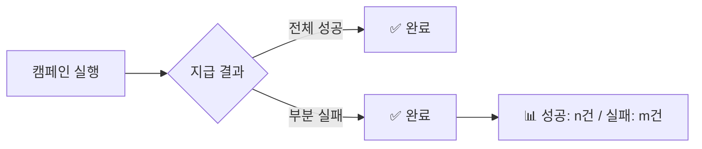
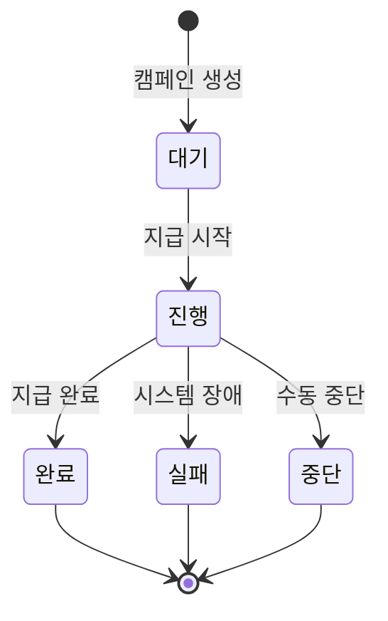
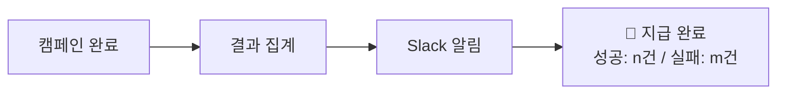
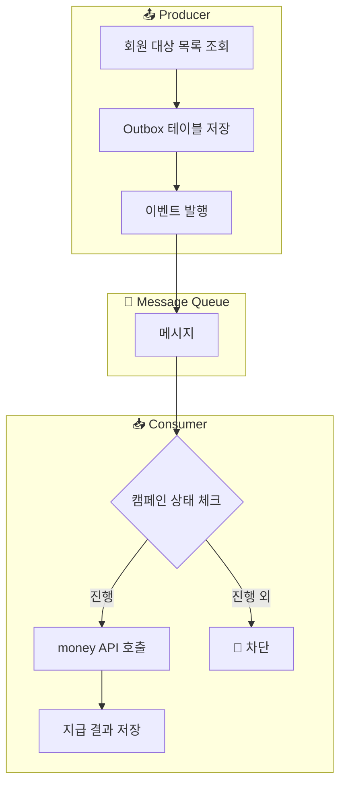

# 🎯 대량 포인트 지급 시스템 요구 사항

## 📌 Overview

> [!info] 프로젝트 목적
> 주문사(무신사)에서 페이먼츠의 머니를 사용하여 결제한 회원들을 대상으로 포인트를 지급하기 위한 **대량 포인트 지급 시스템** 구축

### 핵심 요구 사항 요약

| 항목 | 내용 |
|------|------|
| **최대 지급 대상** | 100만(1M) 회원 |
| **처리 시간 목표** | 1시간 ~ 4시간 |
| **데이터 일관성** | Eventual Consistency |
| **캠페인 동시성** | 순차 처리 (선착순 우선) |

---

## ✅ 기능적 요구 사항

| # | 요구 사항 | 설명 |
|:-:|----------|------|
| 1 | 포인트 지급 | 식별된 지급 대상자 목록 기준 머니 포인트 지급 |
| 2 | 지급 사유 관리 | row별 지급 사유(reason) 기록 |
| 3 | 지급 금액 관리 | row별 다른 지급 금액 설정 가능 |
| 4 | 재처리 프로세스 | 지급 실패 건 재처리 기능 |
| 5 | 중복 지급 방지 | 신규/재지급 시 멱등성 보장 |
| 6 | 다중 캠페인 지원 | 동일 회원이 여러 캠페인 참여 가능 |

---

## ⚡ 비기능적 요구 사항

### 성능 목표

```
┌─────────────────────────────────────────────────────────┐
│  📊 Performance Targets                                  │
├─────────────────────────────────────────────────────────┤
│  • 처리 대상: 1,000,000+ rows                            │
│  • 처리 시간: 1h ~ 4h                                    │
│  • Money 시스템 TPS: 1,000+ (Rate-Limiter 적용)          │
└─────────────────────────────────────────────────────────┘
```

### 설계 범위

> [!note] 설계 포함
> - 캠페인별 대용량 포인트 지급 데이터 모델링
> - 고성능 처리 아키텍처
> - `money` 시스템 API 호출 추상화

> [!warning] 설계 제외
> - 대용량 회원 데이터 수집 프로세스 (이미 DB 적재 완료 가정)

---

## 🔄 재처리 정책

### 재시도 설정

| 항목 | 값 |
|------|---|
| 최대 재시도 횟수 | **3회** |
| 재시도 간격 | **Backoff 3초** |
| 트리거 방식 | 수동 (자동화 검토 필요) |

### 부분 실패 처리



> [!important] 부분 실패 정책
> 일부 건이 실패해도 캠페인 상태는 **`완료`** 처리
> - 성공/실패 건수 별도 관리 필요

---

## 📋 캠페인 운영 정책

### 캠페인 생명주기



### 상태 정의

| 상태 | 설명 | 비고 |
|:----:|------|------|
| `대기` | 포인트 지급 시작 전 | 초기 상태 |
| `진행` | 포인트 지급 진행 중 | 활성 상태 |
| `완료` | 포인트 지급 완료 | 부분 실패 포함 |
| `실패` | 시스템 장애/오류 발생 | 건별 실패 제외 |
| `중단` | 수동으로 지급 중단 | Roll-back 추후 적용 |

### 동시성 제어

```
┌──────────────────────────────────────────────────────────┐
│  🔒 캠페인 동시성 정책                                    │
├──────────────────────────────────────────────────────────┤
│  1. 한 번에 하나의 캠페인만 `진행` 상태 가능               │
│  2. 우선순위: 먼저 생성된 캠페인 우선                      │
│  3. 긴급 시: 강제 진행 권한 기능 검토 필요                 │
└──────────────────────────────────────────────────────────┘
```

### 중단 정책

> [!caution] 중단 시 Roll-back
> - 현재: Roll-back 미지원 (추후 적용 예정)
> - 준비: 지급 결과 이력 관리로 Roll-back 대비

---

## 📊 모니터링 및 운영

### 모니터링 요구 사항

| 기능       | 상세               | 주기                               |
| -------- | ---------------- | -------------------------------- |
| 진행률 모니터링 | 캠페인별 지급 진행률      | **5s 단위** 집계<br>(집계 시간 단위 변경 가능) |
| 완료 알림    | 지급 완료 시 Slack 발송 | 이벤트 기반<br>(Kafka 메시지 브로커 활용)     |
| 감사 로그    | 캠페인 생성/실행 기록     | 실시간                              |

### 알림 체계



---

## 🔐 데이터 일관성

### 일관성 모델

> [!tip] Eventual Consistency (최종 일관성)
> 비동기 처리를 통한 고성능 대량 처리 지원

### Transactional Outbox 패턴



### 지급 상태 관리

| 상태 | 설명 |
|:----:|------|
| `PENDING` | 지급 대기 (Outbox 저장 완료) |
| `PROCESSING` | 지급 처리 중 (Consumer 처리 중) |
| `SUCCESS` | 지급 성공 |
| `FAILED` | 지급 실패 (재처리 대상) |

### 핵심 보장 항목

- [x] **멱등성**: 중복 지급 요청 방지
- [x] **재처리**: 실패 건 재처리 메커니즘
- [x] **상태 체크**: 캠페인 상태가 `진행`이 아니면 지급 차단

---

## 🏗️ 다음 단계

- [ ] High-Level Architecture 설계
- [ ] Data Model 설계
- [ ] Component Design
- [ ] Flow Diagram 작성
