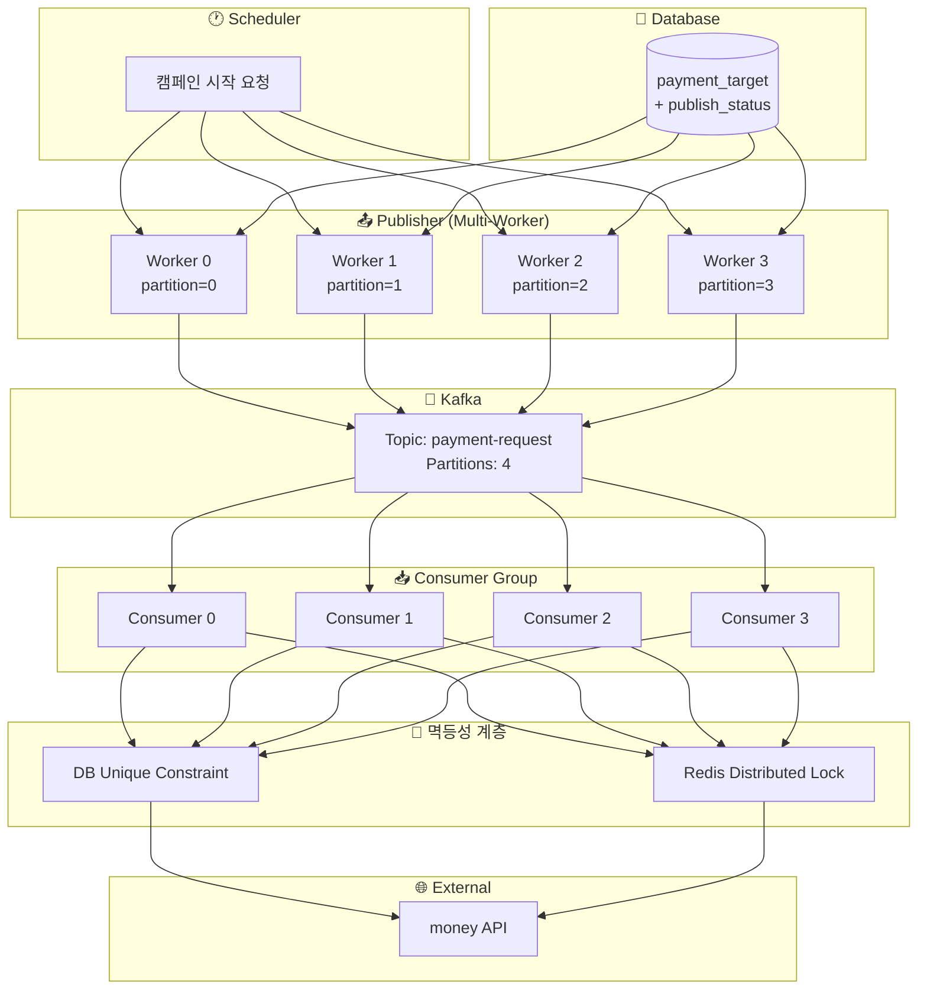
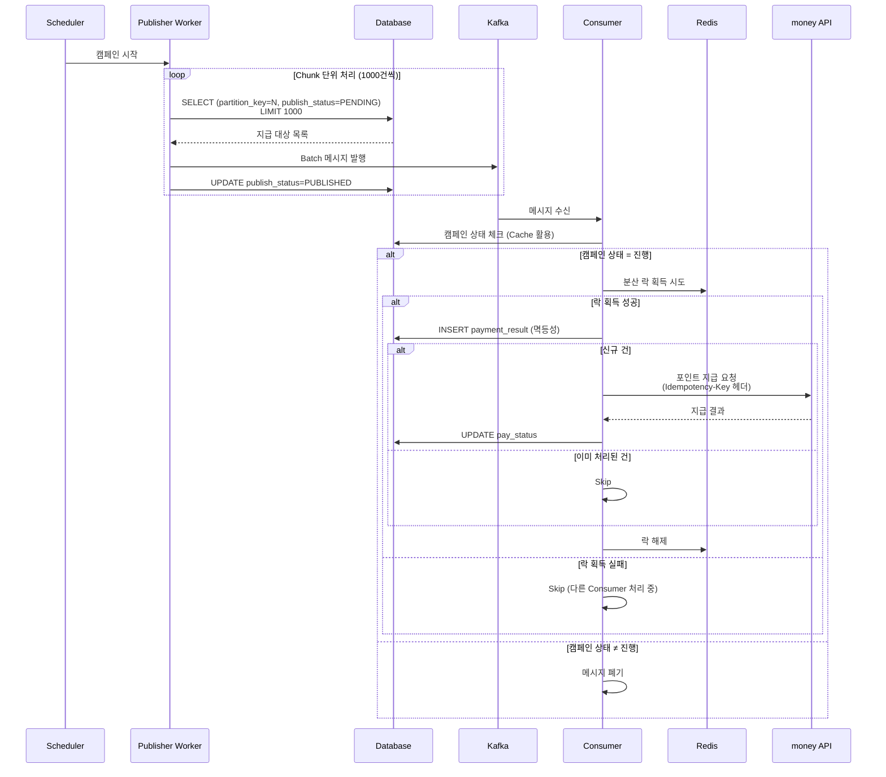
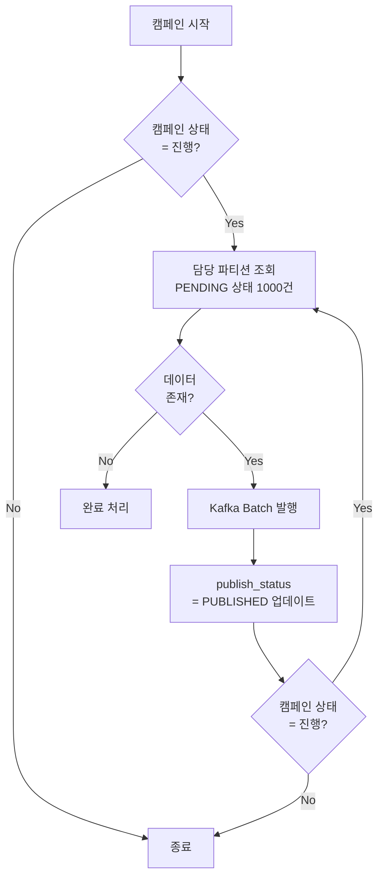
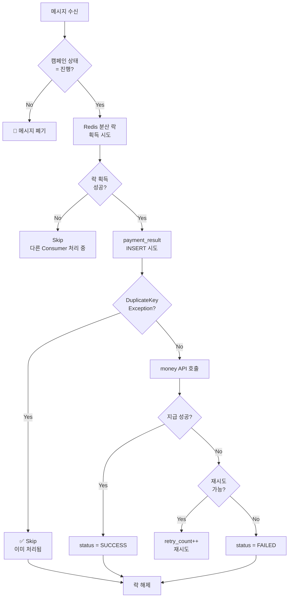
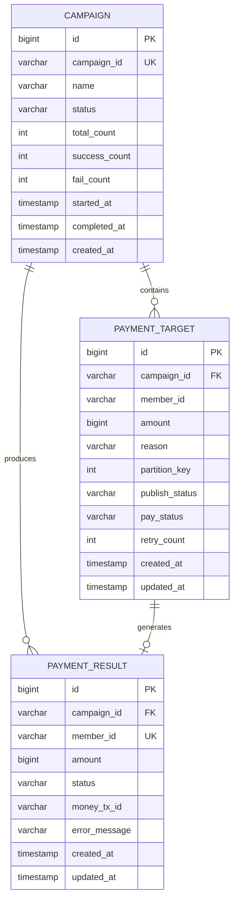
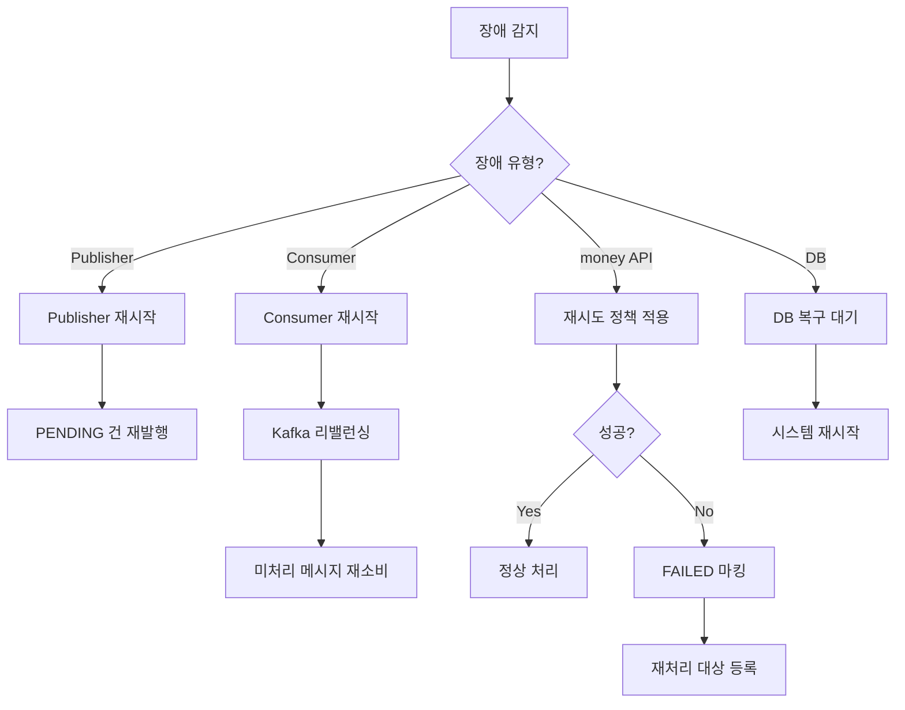

# 🏗️ 대량 포인트 지급 시스템 아키텍처

## 📌 Overview

> [!info] 문서 목적
> 대량 포인트 지급 시스템의 아키텍처 설계 문서
> - 요구 사항: [[01_Requirement]]

### 아키텍처 선택: 하이브리드 방식 (Chunk + Partitioning)

> [!tip] 선택 이유
> - Outbox 테이블 100만 row 적재 부담 제거
> - 파티셔닝을 통한 병렬 처리로 고성능 달성
> - Chunk 단위 제어로 캠페인 중단 용이

### 아키텍처 비교

| 방식 | 장점 | 단점 | 추천도 |
|------|------|------|:------:|
| Transactional Outbox | 데이터 일관성 보장, At-least-once | Outbox 테이블 관리 부담, Polling 오버헤드 | ⭐⭐⭐ |
| Outbox + CDC (Debezium) | 실시간 이벤트 캡처 | 인프라 복잡도 증가 | ⭐⭐⭐⭐ |
| 직접 Kafka 발행 | 단순함 | DB-Kafka 불일치 가능 | ⭐⭐ |
| **하이브리드 (Chunk + Partitioning)** | Outbox 불필요, 직접 제어 가능 | 멱등성 필수 | ⭐⭐⭐⭐⭐ |

---

## 🏛️ High-Level Architecture



### 컴포넌트 역할

| 컴포넌트 | 역할 | 비고 |
|----------|------|------|
| **Scheduler** | 캠페인 시작/중단 트리거 | Admin API 또는 배치 |
| **Publisher** | DB 조회 → Kafka 발행 | Multi-Worker 병렬 처리 |
| **Kafka** | 메시지 브로커 | 파티션별 순서 보장 |
| **Consumer** | 메시지 소비 → money API 호출 | Consumer Group |
| **멱등성 계층** | 중복 처리 방지 | DB + Redis |

---

## 🔄 처리 흐름

### 전체 시퀀스 다이어그램



### Publisher 처리 흐름



### Consumer 처리 흐름



---

## 🔀 병렬 처리 전략

### 파티셔닝 (Partitioning)

> [!note] 핵심 원리
> 각 Worker가 담당할 데이터 범위를 미리 분리하여 **중복 조회 방지**

```
┌─────────────────────────────────────────────────────────────┐
│  🔀 Partition 분배 (Worker 4개 기준)                         │
├─────────────────────────────────────────────────────────────┤
│  Worker 0: partition_key = 0  (약 25만 건)                   │
│  Worker 1: partition_key = 1  (약 25만 건)                   │
│  Worker 2: partition_key = 2  (약 25만 건)                   │
│  Worker 3: partition_key = 3  (약 25만 건)                   │
└─────────────────────────────────────────────────────────────┘
```

### 파티션 키 생성

```sql
-- 데이터 적재 시 파티션 키 계산
-- member_id 기반 해시 → 균등 분배
UPDATE payment_target 
SET partition_key = MOD(ABS(CRC32(member_id)), 4)
WHERE campaign_id = :campaignId;
```

### Publisher 쿼리

```sql
-- Worker 0의 Chunk 조회
SELECT * FROM payment_target 
WHERE campaign_id = :campaignId 
  AND partition_key = 0
  AND publish_status = 'PENDING'
ORDER BY id
LIMIT 1000;

-- 발행 완료 마킹
UPDATE payment_target 
SET publish_status = 'PUBLISHED', 
    updated_at = NOW()
WHERE id IN (:publishedIds);
```

### 대안: SELECT FOR UPDATE SKIP LOCKED

> [!info] 동적 분배가 필요한 경우
> 파티션 없이 DB 락으로 중복 조회 방지

```sql
BEGIN;

SELECT * FROM payment_target 
WHERE campaign_id = :campaignId 
  AND publish_status = 'PENDING'
ORDER BY id
LIMIT 1000
FOR UPDATE SKIP LOCKED;

-- 처리 후
UPDATE payment_target 
SET publish_status = 'PUBLISHED'
WHERE id IN (:ids);

COMMIT;
```

| 방식 | 장점 | 단점 |
|------|------|------|
| **파티셔닝** | DB 부하 낮음, 인덱스 효율적 | 사전 분배 필요 |
| **SKIP LOCKED** | 동적 분배, 부하 균형 | DB 락 오버헤드 |

---

## 🔐 멱등성 보장 전략

### 3중 보장 구조

```
┌─────────────────────────────────────────────────────────────┐
│  🔐 멱등성 3중 보장                                          │
├─────────────────────────────────────────────────────────────┤
│  Layer 1: DB Unique Constraint (campaign_id + member_id)    │
│  Layer 2: Redis Distributed Lock (선택적)                    │
│  Layer 3: money API Idempotency-Key Header                  │
└─────────────────────────────────────────────────────────────┘
```

### Layer 1: DB Unique Constraint

```sql
CREATE TABLE payment_result (
    id              BIGINT PRIMARY KEY AUTO_INCREMENT,
    campaign_id     VARCHAR(50) NOT NULL,
    member_id       VARCHAR(50) NOT NULL,
    amount          BIGINT NOT NULL,
    status          VARCHAR(20) NOT NULL,
    money_tx_id     VARCHAR(100),
    error_message   VARCHAR(500),
    created_at      TIMESTAMP DEFAULT CURRENT_TIMESTAMP,
    updated_at      TIMESTAMP DEFAULT CURRENT_TIMESTAMP ON UPDATE CURRENT_TIMESTAMP,
    
    -- 멱등성 보장
    UNIQUE KEY uk_idempotency (campaign_id, member_id)
);
```

### Layer 2: Redis 분산 락

```
┌─────────────────────────────────────────────────────────────┐
│  🔒 Redis Lock 설계                                          │
├─────────────────────────────────────────────────────────────┤
│  Key    : payment:{campaign_id}:{member_id}                  │
│  Value  : {consumer_id}                                      │
│  TTL    : 300s (5분)                                         │
│  Command: SET key value NX EX 300                            │
└─────────────────────────────────────────────────────────────┘
```

### Layer 3: money API Idempotency-Key

```
┌─────────────────────────────────────────────────────────────┐
│  🔑 Idempotency Key 설계                                     │
├─────────────────────────────────────────────────────────────┤
│  Header : Idempotency-Key                                    │
│  Value  : {campaign_id}_{member_id}                          │
│  예시   : "C001_M12345"                                      │
└─────────────────────────────────────────────────────────────┘
```

### 처리 로직 (Pseudo Code)

```java
public void processPayment(PaymentMessage msg) {
    String idempotencyKey = msg.getCampaignId() + "_" + msg.getMemberId();
    
    // 1. 캠페인 상태 체크 (캐시 활용)
    if (!isCampaignRunning(msg.getCampaignId())) {
        log.info("Campaign not running, skip: {}", msg.getCampaignId());
        return;
    }
    
    // 2. Redis 분산 락 획득 (선택적)
    String lockKey = "payment:" + idempotencyKey;
    if (!redisLock.tryLock(lockKey, Duration.ofMinutes(5))) {
        log.info("Already processing: {}", idempotencyKey);
        return;
    }
    
    try {
        // 3. DB INSERT 시도 (멱등성 체크)
        PaymentResult result = PaymentResult.create(msg, "PROCESSING");
        paymentResultRepository.insert(result);
        
        // 4. money API 호출 (Idempotency-Key 헤더)
        MoneyResponse response = moneyClient.pay(
            msg.getMemberId(),
            msg.getAmount(),
            idempotencyKey  // Idempotency-Key 헤더
        );
        
        // 5. 결과 업데이트
        result.complete(response);
        paymentResultRepository.update(result);
        
    } catch (DuplicateKeyException e) {
        log.info("Already processed: {}", idempotencyKey);
        
    } catch (MoneyApiException e) {
        handleRetry(msg, e);
        
    } finally {
        redisLock.unlock(lockKey);
    }
}
```

---

## 📊 데이터 모델

### ERD



### 테이블 DDL

```sql
-- 캠페인 테이블
CREATE TABLE campaign (
    id              BIGINT PRIMARY KEY AUTO_INCREMENT,
    campaign_id     VARCHAR(50) NOT NULL UNIQUE,
    name            VARCHAR(200) NOT NULL,
    status          VARCHAR(20) NOT NULL DEFAULT 'PENDING',
    total_count     INT DEFAULT 0,
    success_count   INT DEFAULT 0,
    fail_count      INT DEFAULT 0,
    started_at      TIMESTAMP NULL,
    completed_at    TIMESTAMP NULL,
    created_at      TIMESTAMP DEFAULT CURRENT_TIMESTAMP,
    updated_at      TIMESTAMP DEFAULT CURRENT_TIMESTAMP ON UPDATE CURRENT_TIMESTAMP,
    
    INDEX idx_status (status),
    INDEX idx_created (created_at)
);

-- 지급 대상 테이블
CREATE TABLE payment_target (
    id              BIGINT PRIMARY KEY AUTO_INCREMENT,
    campaign_id     VARCHAR(50) NOT NULL,
    member_id       VARCHAR(50) NOT NULL,
    amount          BIGINT NOT NULL,
    reason          VARCHAR(500),
    partition_key   INT NOT NULL,
    publish_status  VARCHAR(20) DEFAULT 'PENDING',
    pay_status      VARCHAR(20) DEFAULT 'PENDING',
    retry_count     INT DEFAULT 0,
    created_at      TIMESTAMP DEFAULT CURRENT_TIMESTAMP,
    updated_at      TIMESTAMP DEFAULT CURRENT_TIMESTAMP ON UPDATE CURRENT_TIMESTAMP,
    
    INDEX idx_partition_publish (campaign_id, partition_key, publish_status),
    INDEX idx_pay_status (campaign_id, pay_status),
    INDEX idx_retry (campaign_id, pay_status, retry_count)
);

-- 지급 결과 테이블
CREATE TABLE payment_result (
    id              BIGINT PRIMARY KEY AUTO_INCREMENT,
    campaign_id     VARCHAR(50) NOT NULL,
    member_id       VARCHAR(50) NOT NULL,
    amount          BIGINT NOT NULL,
    status          VARCHAR(20) NOT NULL,
    money_tx_id     VARCHAR(100),
    error_message   VARCHAR(500),
    created_at      TIMESTAMP DEFAULT CURRENT_TIMESTAMP,
    updated_at      TIMESTAMP DEFAULT CURRENT_TIMESTAMP ON UPDATE CURRENT_TIMESTAMP,
    
    UNIQUE KEY uk_idempotency (campaign_id, member_id),
    INDEX idx_status (campaign_id, status)
);
```

### 상태 정의

#### Campaign Status

| 상태 | 설명 |
|:----:|------|
| `PENDING` | 캠페인 생성됨, 지급 대기 |
| `RUNNING` | 지급 진행 중 |
| `COMPLETED` | 지급 완료 (부분 실패 포함) |
| `FAILED` | 시스템 장애로 실패 |
| `STOPPED` | 수동 중단 |

#### Payment Status

| 상태 | 설명 |
|:----:|------|
| `PENDING` | 지급 대기 |
| `PUBLISHED` | Kafka 발행 완료 |
| `PROCESSING` | 지급 처리 중 |
| `SUCCESS` | 지급 성공 |
| `FAILED` | 지급 실패 |

---

## 📈 예상 성능

### 처리 시간 산정

| 항목 | 값 |
|------|---|
| 전체 대상 | 1,000,000 건 |
| Worker 수 | 4개 |
| Worker당 처리량 | 250,000 건 |
| money API TPS | 1,000 |
| Worker당 TPS | 250 |
| Worker당 처리 시간 | 250,000 / 250 = **1,000초 (약 17분)** |

> [!success] 예상 결과
> 100만 건 처리 시간: **약 20분** (오버헤드 포함)
> - 요구 사항(1~4시간) 대비 충분한 여유

### 확장성

```
┌─────────────────────────────────────────────────────────────┐
│  📊 Worker 수에 따른 처리 시간                               │
├─────────────────────────────────────────────────────────────┤
│  Worker 4개  : 약 20분                                       │
│  Worker 8개  : 약 10분                                       │
│  Worker 16개 : 약 5분                                        │
│                                                              │
│  ※ money API TPS 제한(1000)이 bottleneck                     │
│  ※ TPS 증가 시 Worker 확장으로 선형 성능 향상 가능            │
└─────────────────────────────────────────────────────────────┘
```

### Bottleneck 분석

| 구간 | 예상 TPS | Bottleneck 여부 |
|------|---------|:---------------:|
| DB 조회 (파티션별) | 10,000+ | ❌ |
| Kafka 발행 | 50,000+ | ❌ |
| Kafka 소비 | 50,000+ | ❌ |
| **money API** | **1,000** | **✅** |
| DB 업데이트 | 5,000+ | ❌ |

---

## ⚠️ 장애 대응

### 장애 시나리오 및 대응

| 장애 상황 | 영향 | 대응 |
|----------|------|------|
| **Publisher 장애** | 발행 중단 | 재시작 시 PENDING 건부터 재발행 → Consumer 멱등성 처리 |
| **Consumer 장애** | 처리 중단 | Kafka Consumer Group 리밸런싱, 메시지 재처리 |
| **Kafka 장애** | 메시지 손실 가능 | Kafka 클러스터 복구, PUBLISHED 상태 건 재발행 |
| **money API 장애** | 지급 실패 | 재시도 3회 후 FAILED 마킹, 재처리 프로세스 |
| **DB 장애** | 전체 중단 | DB 복구 후 재시작, 트랜잭션 롤백된 건 재처리 |
| **Redis 장애** | 락 기능 상실 | DB Unique 제약으로 멱등성 보장 (성능 저하 가능) |

### 복구 프로세스



---

## 🏗️ 다음 단계

- [x] High-Level Architecture 설계
- [x] 처리 흐름 설계
- [x] 병렬 처리 전략 수립
- [x] 멱등성 보장 전략 수립
- [x] 데이터 모델 설계
- [x] 예상 성능 분석
- [x] 장애 대응 방안
- [ ] API Spec 정의
- [ ] 모니터링 대시보드 설계
- [ ] 재처리 프로세스 상세 설계
