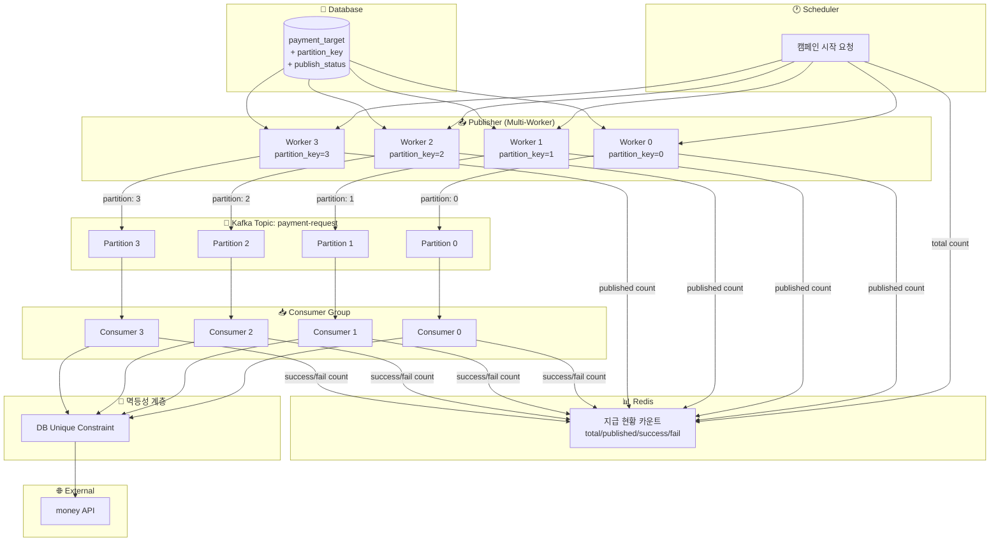
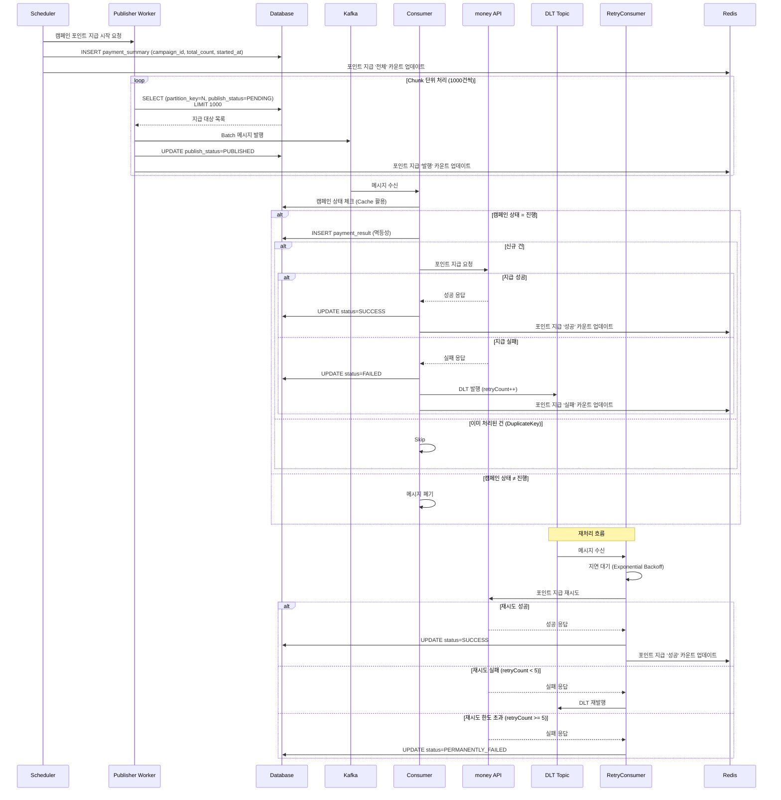
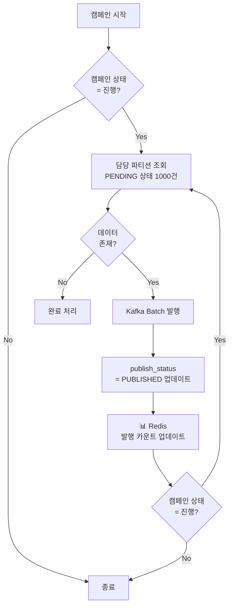
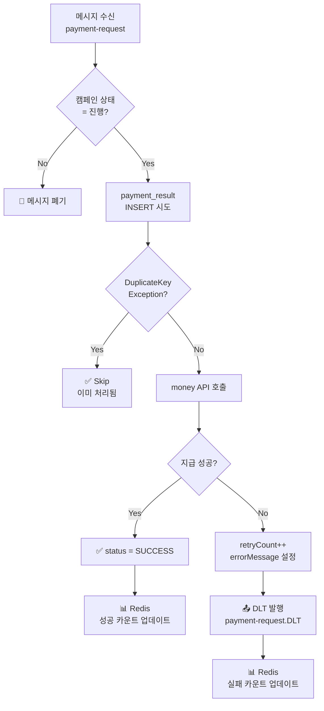
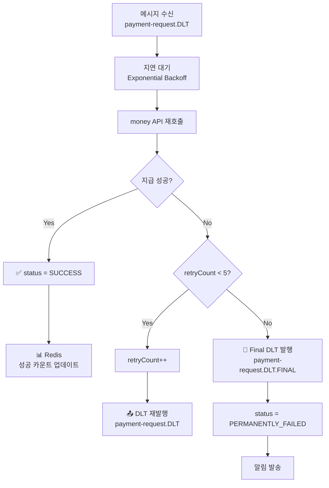
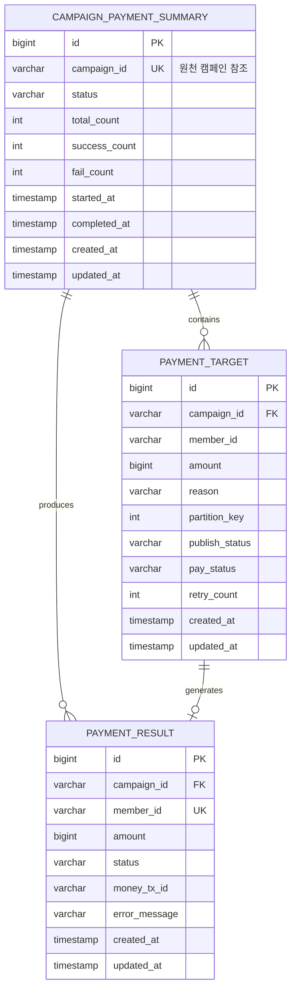
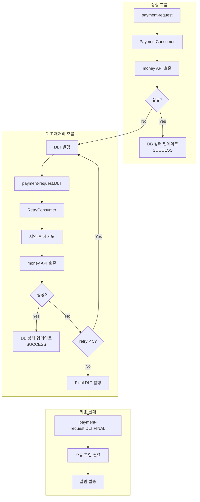
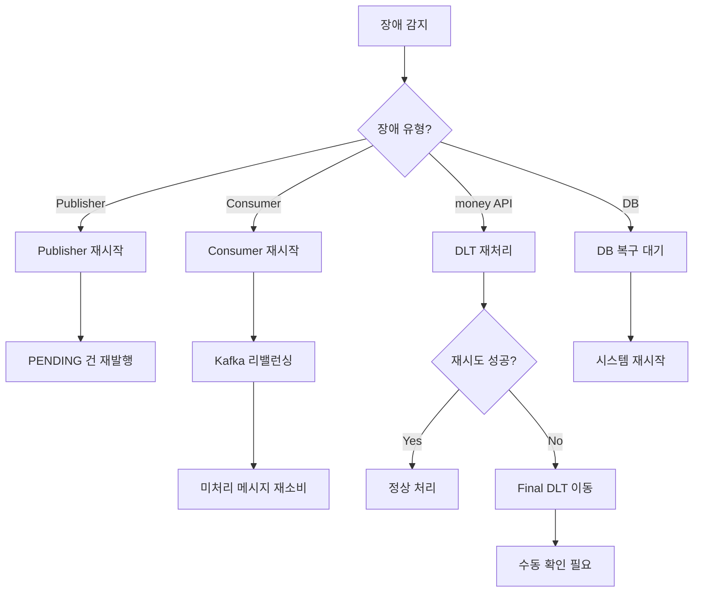

# 🏗️ 대량 포인트 지급 시스템 아키텍처

## 📌 Overview

> [!info] 문서 목적
> 대량 포인트 지급 시스템의 아키텍처 설계 문서
> - 요구 사항: [[01_Requirement]]

### 아키텍처 선택: Chunk + Partitioning 하이브리드 방식

> [!tip] 선택 이유
> - Outbox 테이블 100만 row 적재 부담 제거
> - 파티셔닝을 통한 병렬 처리로 고성능 달성
> - Chunk 단위 제어로 캠페인 중단 용이

### 아키텍처 비교

| 방식                               | 장점                        | 단점                             |  추천도  |
| -------------------------------- | ------------------------- | ------------------------------ | :---: |
| Transactional Outbox             | 데이터 일관성 보장, At-least-once | Outbox 테이블 관리 부담, Polling 오버헤드 |  ⭐⭐⭐  |
| Outbox + CDC (Debezium)          | 실시간 이벤트 캡처                | 인프라 복잡도 증가                     | ⭐⭐⭐⭐  |
| 직접 Kafka 발행                      | 단순함                       | DB-Kafka 불일치 가능                |  ⭐⭐   |
| **하이브리드 (Chunk + Partitioning)** | Outbox 불필요, 직접 제어 가능      | 멱등성 필수                         | ⭐⭐⭐⭐⭐ |

---

## 🏛️ High-Level Architecture



> [!tip] 처리 경로 일관성
> **Worker N → Partition N → Consumer N** 경로가 확정됨
> - DB partition_key를 Kafka Partition으로 직접 지정
> - 해시 알고리즘 불일치 문제 원천 해결

### 컴포넌트 역할

| 컴포넌트 | 역할 | 비고 |
|----------|------|------|
| **Scheduler** | 캠페인 시작/중단 트리거, 전체 카운트 초기화 | Admin API 또는 배치 |
| **Publisher** | DB 조회 → Kafka 발행, 발행 카운트 업데이트 | partition_key로 Kafka 파티션 직접 지정 |
| **Kafka** | 메시지 브로커 | 파티션별 순서 보장 |
| **Consumer** | 메시지 소비 → money API 호출, 성공/실패 카운트 업데이트 | Consumer Group |
| **Redis** | 실시간 지급 현황 카운트 관리 | total, published, success, fail |
| **멱등성 계층** | 중복 처리 방지 | DB Unique Constraint |

---

## 🔄 처리 흐름

### 전체 시퀀스 다이어그램



### Publisher 처리 흐름



### Consumer 처리 흐름 (PaymentConsumer)



### RetryConsumer 처리 흐름



---

## 📦 Kafka 메시지 구조

### 메시지 설계 방식: Fat Message

> [!note] Fat Message 선택 이유
> - Consumer에서 DB 조회 불필요 (성능 향상)
> - 발행 시점 데이터 고정 (감사 추적 용이)
> - 메시지만으로 재처리 가능

### 메시지 스키마

```json
{
  "messageId": "550e8400-e29b-41d4-a716-446655440000",
  "targetId": 12345,
  "campaignId": "C001",
  "memberId": "M12345",
  "amount": 1000,
  "reason": "신년 이벤트 포인트 지급",
  "publishedAt": "2026-01-15T10:30:00Z"
}
```

### 필드 설명

| 필드 | 타입 | 설명 |
|------|------|------|
| `messageId` | UUID | 메시지 고유 식별자 |
| `targetId` | Long | payment_target 테이블 PK |
| `campaignId` | String | 캠페인 식별자 |
| `memberId` | String | 회원 식별자 |
| `amount` | Long | 지급 금액 |
| `reason` | String | 지급 사유 |
| `publishedAt` | ISO8601 | 발행 시각 |

> [!tip] 멱등성 키는 메시지에 포함하지 않음
> `campaign_id + member_id` 조합은 Consumer에서 직접 계산하며, DB Unique Constraint로 중복 처리 방지

---

## 🔑 Kafka 파티션 분배 전략

### 파티션 지정 방식: DB partition_key 직접 사용

> [!important] 핵심 설계
> - **Kafka Partition**: DB에 저장된 `partition_key` 값을 직접 지정
> - **Message Key**: `campaign_id + member_id` (파티션 내 순서 보장용)
> - DB 파티션과 Kafka 파티션의 완벽한 일치 보장

```
┌─────────────────────────────────────────────────────────────┐
│  🔑 파티션 & 키 설계                                            │
├─────────────────────────────────────────────────────────────┤
│                                                             │
│  [Kafka 발행 시]                                              │
│  ┌─────────────────────────────────────────────────────┐    │
│  │ topic     : payment-request                         │    │
│  │ partition : partition_key (DB 저장값, 직접 지정)       │    │
│  │ key       : campaign_id + member_id (순서 보장용)     │    │
│  │ value     : PaymentMessage                          │    │
│  └─────────────────────────────────────────────────────┘    │
│                                                             │
│  DB partition_key = 0  →  Kafka Partition 0 (확정)          │
│  DB partition_key = 1  →  Kafka Partition 1 (확정)          │
│  DB partition_key = 2  →  Kafka Partition 2 (확정)          │
│  DB partition_key = 3  →  Kafka Partition 3 (확정)          │
│                                                             │
└─────────────────────────────────────────────────────────────┘
```

### 왜 직접 지정인가? (해시 불일치 문제 해결)

```
┌─────────────────────────────────────────────────────────────┐
│  ⚠️ 기존 방식의 문제점 (해시 기반)                                │
├─────────────────────────────────────────────────────────────┤
│                                                             │
│  DB partition_key 계산:                                      │
│    Java hashCode() 또는 MySQL CRC32() 사용                   │
│    → hash("C001M001") % 4 = 0                               │
│                                                             │
│  Kafka partition 계산:                                       │
│    murmur2 해시 알고리즘 사용 (Kafka 기본)                      │
│    → murmur2("C001_M001") % 4 = 2  ← 다를 수 있음!            │
│                                                             │
│  결과:                                                       │
│    Publisher Worker 0 → SELECT partition_key = 0            │
│    Kafka 발행 → murmur2(key) = Partition 2로 전송            │
│    Consumer 2가 처리 ← DB 파티션과 불일치!                      │
│                                                             │
└─────────────────────────────────────────────────────────────┘

┌─────────────────────────────────────────────────────────────┐
│  ✅ 개선 방식 (직접 지정)                                       │
├─────────────────────────────────────────────────────────────┤
│                                                             │
│  Publisher Worker 0 → SELECT partition_key = 0              │
│  Kafka 발행 (partition: 0 직접 지정)                          │
│  → 확정적으로 Partition 0으로 전송                             │
│  → Consumer 0이 처리                                         │
│                                                             │
│  처리 경로가 명확하게 예측 가능:                                 │
│  Publisher Worker N → Partition N → Consumer N              │
│                                                             │
└─────────────────────────────────────────────────────────────┘
```

### 구현 코드

```java
@Component
public class PaymentPublisher {
    
    private final KafkaTemplate<String, PaymentMessage> kafkaTemplate;
    
    public void publish(PaymentTarget target) {
        PaymentMessage message = PaymentMessage.from(target);
        
        // partition을 직접 지정하여 발행
        kafkaTemplate.send(
            "payment-request",                                    // topic
            target.getPartitionKey(),                             // partition (DB 저장값)
            target.getCampaignId() + "_" + target.getMemberId(),  // key (순서 보장)
            message                                               // value
        );
    }
}
```

### 키 일관성

```
┌─────────────────────────────────────────────────────────────┐
│  🔑 키 일관성                                                  │
├─────────────────────────────────────────────────────────────┤
│                                                             │
│  DB partition_key     : 0, 1, 2, 3 (hash % partitionCount)  │
│  Kafka Partition      : 0, 1, 2, 3 (partition_key 직접 지정)  │
│  Kafka Message Key    : campaign_id + member_id             │
│  DB Unique Key        : (campaign_id, member_id)            │
│  멱등성 키             : campaign_id + member_id              │
│                                                             │
│  → DB 파티션 = Kafka 파티션 (완벽 일치)                         │
│  → Message Key = 멱등성 키 (일관성 유지)                        │
│                                                             │
└─────────────────────────────────────────────────────────────┘
```

### 주의사항

> [!warning] 파티션 수 일치 필수
> - DB partition_key 범위: `0 ~ (N-1)`
> - Kafka 파티션 수: `N`
> - 불일치 시 `InvalidPartitionException` 발생

```
┌─────────────────────────────────────────────────────────────┐
│  ⚠️ 파티션 확장 시 주의                                        │
├─────────────────────────────────────────────────────────────┤
│                                                             │
│  Kafka 파티션 4 → 8 확장 시:                                   │
│  - 기존 데이터 partition_key (0~3)는 그대로 유효               │
│  - 신규 데이터만 0~7 범위로 생성                               │
│  - 점진적으로 새 파티션 활용됨                                  │
│                                                             │
│  권장 절차:                                                   │
│  1. Kafka 파티션 확장                                         │
│  2. Consumer 확장                                            │
│  3. 애플리케이션 partitionCount 설정 변경                      │
│  4. 신규 캠페인부터 새 파티션 수 적용                           │
│                                                             │
└─────────────────────────────────────────────────────────────┘
```

### 장점 요약

| 항목 | 설명 |
|------|------|
| **DB-Kafka 일치** | partition_key와 Kafka Partition 완벽 일치 |
| **예측 가능성** | Worker N → Partition N → Consumer N 경로 확정 |
| **디버깅 용이** | 문제 발생 시 추적 경로 명확 |
| **해시 불일치 제거** | 다른 해시 알고리즘 문제 원천 해결 |
| **순서 보장 유지** | Message Key로 파티션 내 순서 보장 |

---

## 🔀 병렬 처리 전략

### 파티셔닝 (Partitioning)

> [!note] 핵심 원리
> 각 Worker가 담당할 데이터 범위를 미리 분리하여 **중복 조회 방지**

```
┌─────────────────────────────────────────────────────────────┐
│  🔀 Partition 분배 (Worker 4개 기준)                           │
├─────────────────────────────────────────────────────────────┤
│  Worker 0: partition_key = 0  (약 25만 건)                   │
│  Worker 1: partition_key = 1  (약 25만 건)                   │
│  Worker 2: partition_key = 2  (약 25만 건)                   │
│  Worker 3: partition_key = 3  (약 25만 건)                   │
└─────────────────────────────────────────────────────────────┘
```

### 파티션 키 생성

> [!tip] 선택: Option C (INSERT 시 계산)
> - 파티션 수 변경 시 DDL 변경 없이 애플리케이션 설정만 수정
> - 캠페인별 다른 파티션 수 적용 가능
> - 상세 내용: [[#📎 부록: partition_key 생성 전략|부록: partition_key 생성 전략]] 참조

```java
// INSERT 시 partition_key 계산
public void savePaymentTarget(PaymentTarget target, int partitionCount) {
    String hashSource = target.getCampaignId() + target.getMemberId();
    int partitionKey = Math.abs(hashSource.hashCode()) % partitionCount;
    target.setPartitionKey(partitionKey);
    
    paymentTargetRepository.save(target);
}
```

### Publisher 쿼리

```sql
-- Worker 0의 Chunk 조회
SELECT * FROM payment_target 
WHERE campaign_id = :campaignId 
  AND partition_key = 0
  AND publish_status = 'PENDING'
ORDER BY id
LIMIT 1000;

-- 발행 완료 마킹
UPDATE payment_target 
SET publish_status = 'PUBLISHED', 
    updated_at = NOW()
WHERE id IN (:publishedIds);
```

---

## 🔐 멱등성 보장 전략

### 단일 계층 구조: DB Unique Constraint

> [!note] 간소화 배경
> - DB partition_key를 Kafka Partition으로 직접 지정 → **Worker N → Partition N → Consumer N 경로 확정**
> - Message Key(`campaign_id + member_id`)로 파티션 내 순서 보장
> - **DB Unique Constraint 단일 계층으로 충분**
> - 외부 서비스(money API) 의존성 제거로 결합도 감소

```
┌─────────────────────────────────────────────────────────────┐
│  🔐 멱등성 보장 구조                                            │
├─────────────────────────────────────────────────────────────┤
│  DB Unique Constraint (campaign_id + member_id)             │
│  → INSERT 시도 시 중복이면 DuplicateKeyException 발생            │
│  → 예외 처리로 Skip 하여 멱등성 보장                               │
└─────────────────────────────────────────────────────────────┘
```

```
┌─────────────────────────────────────────────────────────────┐
│  ✅ 왜 단일 계층으로 충분한가?                                    │
├─────────────────────────────────────────────────────────────┤
│  1. Kafka 파티션 직접 지정 + Message Key 순서 보장               │
│     - Partition: DB partition_key로 직접 지정                  │
│     - Message Key: campaign_id + member_id                   │
│     → 같은 회원 메시지는 같은 파티션 → 같은 Consumer               │
│     → 파티션 내 순서 보장으로 동시 처리 불가                         │
│                                                             │
│  2. DB Unique Constraint                                    │
│     → Consumer 리밸런싱, 메시지 재발행 시에도 중복 방지              │
│     → 어떤 예외 상황에서도 중복 INSERT 원천 차단                    │
│                                                             │
│  ※ 외부 API(money) Idempotency-Key 미사용                      │
│     → money 서비스 스펙 변경에 영향받지 않음                        │
│     → 내부 시스템에서 완결된 멱등성 보장                             │
└─────────────────────────────────────────────────────────────┘
```

### DB Unique Constraint 설계

```sql
CREATE TABLE payment_result (
    id              BIGINT PRIMARY KEY AUTO_INCREMENT,
    campaign_id     VARCHAR(50) NOT NULL,
    member_id       VARCHAR(50) NOT NULL,
    amount          BIGINT NOT NULL,
    status          VARCHAR(20) NOT NULL,
    money_tx_id     VARCHAR(100),
    error_message   VARCHAR(500),
    created_at      TIMESTAMP DEFAULT CURRENT_TIMESTAMP,
    updated_at      TIMESTAMP DEFAULT CURRENT_TIMESTAMP ON UPDATE CURRENT_TIMESTAMP,
    
    -- 멱등성 보장
    UNIQUE KEY uk_idempotency (campaign_id, member_id)
);
```

### 처리 로직

```
┌─────────────────────────────────────────────────────────────┐
│  📥 Consumer 처리 흐름                                        │
├─────────────────────────────────────────────────────────────┤
│                                                             │
│  ┌─────────────┐                                            │
│  │ 메시지 수신    │                                            │
│  └──────┬──────┘                                            │
│         ▼                                                   │
│  ┌─────────────────┐    No    ┌──────────┐                  │
│  │ 캠페인 상태 체크    │─────────→│ Skip     │                  │
│  │ (캐시 활용)       │          │ 메시지폐기  │                  │
│  └────────┬────────┘          └──────────┘                  │
│           │ Yes                                             │
│           ▼                                                 │
│  ┌──────────────────────────┐                               │
│  │ DB INSERT 시도            │                               │
│  │ payment_result 테이블      │                               │
│  │ (campaign_id, member_id) │                               │
│  └────────┬─────────────────┘                               │
│           │                                                 │
│     ┌─────┴─────┐                                           │
│     ▼           ▼                                           │
│  ┌──────┐   ┌────────────────┐                              │
│  │ 성공  │   │ DuplicateKey   │                              │
│  └──┬───┘   │ Exception      │                              │
│     │       └───────┬────────┘                              │
│     │               ▼                                       │
│     │       ┌──────────────┐                                │
│     │       │ ✅ Skip      │                                │
│     │       │ (이미 처리됨)   │                                │
│     │       └──────────────┘                                │
│     ▼                                                       │
│  ┌─────────────────┐                                        │
│  │ money API 호출   │                                        │
│  │ 포인트 지급 요청    │                                        │
│  └────────┬────────┘                                        │
│           │                                                 │
│     ┌─────┴─────┐                                           │
│     ▼           ▼                                           │
│  ┌──────┐   ┌──────────────┐                                │
│  │ 성공  │   │ 실패          │                                │
│  └──┬───┘   └──────┬───────┘                                │
│     │              ▼                                        │
│     │       ┌──────────────┐                                │
│     │       │ DLT 발행      │                                │
│     │       │ + Redis 실패  │                                │
│     │       │   카운트 ++   │                                │
│     │       └──────────────┘                                │
│     ▼                                                       │
│  ┌─────────────────────┐                                    │
│  │ 결과 업데이트          │                                    │
│  │ status = SUCCESS    │                                    │
│  │ + Redis 성공 카운트 ++ │                                    │
│  └─────────────────────┘                                    │
│                                                             │
└─────────────────────────────────────────────────────────────┘
```

---

## 📊 데이터 모델

### ERD



### 테이블 DDL

```sql
-- 캠페인 지급 현황 테이블
CREATE TABLE campaign_payment_summary (
    id              BIGINT PRIMARY KEY AUTO_INCREMENT,
    campaign_id     VARCHAR(50) NOT NULL UNIQUE,  -- 원천 캠페인 참조 키
    status          VARCHAR(20) NOT NULL DEFAULT 'PENDING',
    total_count     INT DEFAULT 0,
    success_count   INT DEFAULT 0,
    fail_count      INT DEFAULT 0,
    started_at      TIMESTAMP NULL,
    completed_at    TIMESTAMP NULL,
    created_at      TIMESTAMP DEFAULT CURRENT_TIMESTAMP,
    updated_at      TIMESTAMP DEFAULT CURRENT_TIMESTAMP ON UPDATE CURRENT_TIMESTAMP,
    
    INDEX idx_status (status),
    INDEX idx_created (created_at)
) COMMENT '캠페인 지급 현황';

-- 지급 대상 테이블
CREATE TABLE payment_target (
    id              BIGINT PRIMARY KEY AUTO_INCREMENT,
    campaign_id     VARCHAR(50) NOT NULL,
    member_id       VARCHAR(50) NOT NULL,
    amount          BIGINT NOT NULL,
    reason          VARCHAR(500),
    partition_key   INT NOT NULL,
    publish_status  VARCHAR(20) DEFAULT 'PENDING',
    pay_status      VARCHAR(20) DEFAULT 'PENDING',
    retry_count     INT DEFAULT 0,
    created_at      TIMESTAMP DEFAULT CURRENT_TIMESTAMP,
    updated_at      TIMESTAMP DEFAULT CURRENT_TIMESTAMP ON UPDATE CURRENT_TIMESTAMP,
    
    INDEX idx_partition_publish (campaign_id, partition_key, publish_status),
    INDEX idx_pay_status (campaign_id, pay_status),
    INDEX idx_retry (campaign_id, pay_status, retry_count)
);

-- 지급 결과 테이블
CREATE TABLE payment_result (
    id              BIGINT PRIMARY KEY AUTO_INCREMENT,
    campaign_id     VARCHAR(50) NOT NULL,
    member_id       VARCHAR(50) NOT NULL,
    amount          BIGINT NOT NULL,
    status          VARCHAR(20) NOT NULL,
    money_tx_id     VARCHAR(100),
    error_message   VARCHAR(500),
    created_at      TIMESTAMP DEFAULT CURRENT_TIMESTAMP,
    updated_at      TIMESTAMP DEFAULT CURRENT_TIMESTAMP ON UPDATE CURRENT_TIMESTAMP,
    
    UNIQUE KEY uk_idempotency (campaign_id, member_id),
    INDEX idx_status (campaign_id, status)
);
```

### 상태 정의

#### Campaign Payment Status (캠페인 지급 상태)

| 상태 | 설명 |
|:----:|------|
| `PENDING` | 캠페인 생성됨, 지급 대기 |
| `RUNNING` | 지급 진행 중 |
| `COMPLETED` | 지급 완료 (부분 실패 포함) |
| `FAILED` | 시스템 장애로 실패 |
| `STOPPED` | 수동 중단 |

#### Payment Status

| 상태 | 설명 |
|:----:|------|
| `PENDING` | 지급 대기 |
| `PUBLISHED` | Kafka 발행 완료 |
| `PROCESSING` | 지급 처리 중 |
| `SUCCESS` | 지급 성공 |
| `FAILED` | 지급 실패 (DLT 재처리 대상) |
| `PERMANENTLY_FAILED` | 재처리 한도 초과 (최종 실패) |

---

## 📈 예상 성능

### Publisher vs Consumer 역할 구분

| 컴포넌트 | 역할 | 병목 여부 |
|----------|------|:--------:|
| **Publisher** | DB 조회 → Kafka 발행 | ❌ 빠름 |
| **Consumer** | Kafka 소비 → money API 호출 | ✅ **병목** |

```
┌─────────────────────────────────────────────────────────────┐
│  🔄 처리 속도 비교                                           │
├─────────────────────────────────────────────────────────────┤
│  Publisher: DB 조회 + Kafka 발행 → 10,000+ msg/s 가능        │
│  Consumer: money API 호출 → 1,000 TPS 제한 (병목)            │
│                                                              │
│  → Kafka가 속도 차이를 버퍼링!                               │
└─────────────────────────────────────────────────────────────┘
```

### 처리 시간 산정

| 항목 | 값 | 설명 |
|------|---|------|
| 전체 대상 | 1,000,000 건 | |
| Kafka 파티션 수 | 4개 | |
| Consumer 수 | 4개 | 파티션당 1개 |
| money API TPS | 1,000 | 전체 Consumer 합산 |
| Consumer당 TPS | 250 | 1000 / 4 |
| 처리 시간 | 1,000,000 / 1,000 = **1,000초 (약 17분)** | |

> [!success] 예상 결과
> 100만 건 처리 시간: **약 20분** (오버헤드 포함)
> - 요구 사항(1~4시간) 대비 충분한 여유

### 확장성

```
┌─────────────────────────────────────────────────────────────┐
│  📊 Consumer 수에 따른 처리 시간                                 │
├─────────────────────────────────────────────────────────────┤
│  Consumer 4개  (파티션 4개) : 약 20분                           │
│  Consumer 8개  (파티션 8개) : 약 10분                           │
│  Consumer 16개 (파티션 16개): 약 5분                            │
│                                                             │
│  ※ Consumer 수 ≤ Kafka 파티션 수 (중요!)                        │
│  ※ money API TPS 제한(1000)이 최종 bottleneck                  │
│  ※ money API TPS 증가 시 Consumer 확장으로 선형 성능 향상          |
└─────────────────────────────────────────────────────────────┘
```

### Consumer 스케일링 주의사항

> [!warning] Consumer 수 ≤ Kafka 파티션 수
> - 파티션 4개 → Consumer 최대 4개까지만 병렬 처리
> - Consumer 5개 이상 배포해도 1개는 유휴 상태
> - 더 많은 병렬 처리 필요 시 **파티션 수 증가 필요**

```
┌─────────────────────────────────────────────────────────────┐
│  ⚠️ 파티션 < Consumer 인 경우                                │
├─────────────────────────────────────────────────────────────┤
│                                                              │
│  Kafka 파티션: 4개                                           │
│  Consumer: 6개                                               │
│                                                              │
│  → Consumer 0~3: 각 파티션 담당 (활성)                       │
│  → Consumer 4~5: 담당 파티션 없음 (유휴)                     │
│                                                              │
└─────────────────────────────────────────────────────────────┘
```

### Bottleneck 분석

| 구간 | 예상 TPS | Bottleneck 여부 |
|------|---------|:---------------:|
| DB 조회 (파티션별) | 10,000+ | ❌ |
| Kafka 발행 | 50,000+ | ❌ |
| Kafka 소비 | 50,000+ | ❌ |
| **money API** | **1,000** | **✅** |
| DB 업데이트 | 5,000+ | ❌ |

---

## 🔄 재처리 프로세스 (DLT 기반)

### 개요

> [!note] DLT(Dead Letter Topic) 패턴
> 처리 실패한 메시지를 별도 토픽으로 분리하여 재처리하는 Kafka 패턴입니다.
> Fat Message를 활용하여 DB 재조회 없이 메시지만으로 재처리가 가능합니다.

### 토픽 구조

```
┌─────────────────────────────────────────────────────────────┐
│  📨 토픽 구조                                                 │
├─────────────────────────────────────────────────────────────┤
│                                                             │
│  payment-request          정상 처리 토픽                       │
│       │                                                     │
│       │ 실패 시                                               │
│       ▼                                                     │
│  payment-request.DLT      재처리 대상 토픽                      │
│       │                                                     │
│       │ 재시도 한도 초과 시                                      │
│       ▼                                                     │
│  payment-request.DLT.FINAL  최종 실패 토픽 (수동 확인)            │
│                                                             │
└─────────────────────────────────────────────────────────────┘
```

| 토픽 | 역할 | Consumer |
|------|------|----------|
| `payment-request` | 정상 처리 | PaymentConsumer |
| `payment-request.DLT` | 재처리 대상 | RetryConsumer |
| `payment-request.DLT.FINAL` | 최종 실패 (수동 확인) | - (모니터링) |

### 재처리 아키텍처



### 메시지 구조 (재처리 필드 추가)

```json
{
  "messageId": "550e8400-e29b-41d4-a716-446655440000",
  "targetId": 12345,
  "campaignId": "C001",
  "memberId": "M12345",
  "amount": 1000,
  "reason": "신년 이벤트 포인트 지급",
  "publishedAt": "2026-01-15T10:30:00Z",
  "retryCount": 0,
  "errorMessage": null,
  "lastFailedAt": null
}
```

| 필드 | 타입 | 설명 |
|------|------|------|
| `retryCount` | Integer | 재시도 횟수 |
| `errorMessage` | String | 마지막 실패 원인 |
| `lastFailedAt` | ISO8601 | 마지막 실패 시각 |

### Consumer 처리 로직

```
┌─────────────────────────────────────────────────────────────┐
│  📥 PaymentConsumer 처리 로직                                 │
├─────────────────────────────────────────────────────────────┤
│                                                             │
│  1. 메시지 수신 (payment-request)                              │
│  2. 캠페인 상태 체크                                            │
│  3. DB INSERT (멱등성 체크)                                    │
│  4. money API 호출                                           │
│     │                                                       │
│     ├─ 성공 → DB UPDATE (SUCCESS)                            │
│     │         Redis 성공 카운트 ++                             │
│     │                                                       │
│     └─ 실패 → retryCount++                                   │
│              errorMessage 설정                               │
│              payment-request.DLT 로 발행                      │
│              Redis 실패 카운트 ++                              │
│                                                             │
└─────────────────────────────────────────────────────────────┘
```

```
┌─────────────────────────────────────────────────────────────┐
│  🔄 RetryConsumer 처리 로직                                    │
├─────────────────────────────────────────────────────────────┤
│                                                             │
│  1. 메시지 수신 (payment-request.DLT)                          │
│  2. 지연 시간 계산 (Exponential Backoff)                        │
│     - 1회차: 1분                                              │
│     - 2회차: 2분                                              │
│     - 3회차: 4분                                              │
│     - 4회차: 8분                                              │
│  3. 지연 후 money API 재호출                                    │
│     │                                                       │
│     ├─ 성공 → DB UPDATE (SUCCESS)                            │
│     │         Redis 성공 카운트 ++                             │
│     │                                                       │
│     └─ 실패 → retryCount 체크                                 │
│              │                                              │
│              ├─ < 5회 → payment-request.DLT 재발행            │
│              │                                              │
│              └─ ≥ 5회 → payment-request.DLT.FINAL 발행        │
│                         DB UPDATE (PERMANENTLY_FAILED)      │
│                         알림 발송                             │
│                                                             │
└─────────────────────────────────────────────────────────────┘
```

### 상태 정의 (확장)

|          상태          | 설명                              |
| :------------------: | ------------------------------- |
|       `FAILED`       | 지급 실패 (DLT에서 재처리 중)             |
| `PERMANENTLY_FAILED` | 재처리 한도 초과 (최종 실패, 수동 확인 필요)    |

> [!note] 상태 전이 흐름
> - **첫 실패**: `PENDING` → `FAILED` + DLT 발행
> - **재시도 성공**: `FAILED` → `SUCCESS`
> - **재시도 한도 초과**: `FAILED` → `PERMANENTLY_FAILED` + Final DLT 발행

### DLT 방식의 장점

```
┌─────────────────────────────────────────────────────────────┐
│  ✅ DLT 방식 장점                                             │
├─────────────────────────────────────────────────────────────┤
│                                                             │
│  1. DB 부하 감소                                              │
│     - 주기적 FAILED 건 조회 불필요                               │
│     - 메시지만으로 재처리 가능 (Fat Message)                      │
│                                                             │
│  2. 실시간 재처리                                              │
│     - 실패 즉시 DLT 대기열로 이동                                │
│     - 배치 주기 대기 없음                                       │
│                                                             │
│  3. 격리된 처리                                                │
│     - 재처리 로직이 정상 흐름에 영향 없음                           │
│     - 별도 Consumer 그룹으로 독립 운영                           │
│                                                             │
│  4. 모니터링 용이                                              │
│     - DLT 토픽 lag 모니터링                                    │
│     - Final DLT 메시지 수 알림                                 │
│                                                             │
│  5. Kafka 생태계 활용                                          │
│     - 메시지 보존 (retention)                                  │
│     - Replay 가능                                            │
│                                                             │
└─────────────────────────────────────────────────────────────┘
```

### 모니터링 포인트

| 메트릭 | 설명 | 알림 기준 |
|--------|------|----------|
| `payment-request.DLT` lag | 재처리 대기 건수 | > 1000건 |
| `payment-request.DLT.FINAL` 메시지 수 | 최종 실패 건수 | > 0건 (즉시 알림) |
| RetryConsumer 처리 시간 | 재처리 평균 소요 시간 | > 5분 |

---

## ⚠️ 장애 대응

### 장애 시나리오 및 대응

| 장애 상황 | 영향 | 대응 |
|----------|------|------|
| **Publisher 장애** | 발행 중단 | 재시작 시 PENDING 건부터 재발행 → Consumer 멱등성 처리 |
| **Consumer 장애** | 처리 중단 | Kafka Consumer Group 리밸런싱, 메시지 재처리 |
| **Kafka 장애** | 메시지 손실 가능 | Kafka 클러스터 복구, PUBLISHED 상태 건 재발행 |
| **money API 장애** | 지급 실패 | DLT 기반 재처리 프로세스 |
| **DB 장애** | 전체 중단 | DB 복구 후 재시작, 트랜잭션 롤백된 건 재처리 |

### 복구 프로세스



---

## 📎 부록: Kafka 사용 이유

> [!question] 왜 Kafka가 필요한가?
> DB 파티셔닝만으로 병렬 처리가 가능한데, 왜 Publisher → Kafka → Consumer 구조를 사용하는가?

### 핵심 이유

| 이유 | 설명 |
|------|------|
| **비동기 처리** | Publisher는 API 응답을 기다리지 않고 계속 발행 가능 |
| **버퍼링** | money API TPS 제한(1000)에 맞춰 Consumer가 조절 |
| **장애 격리** | money API 장애 시에도 메시지는 Kafka에 안전하게 보관 |
| **재처리** | Consumer offset 리셋으로 과거 메시지 재처리 가능 |
| **독립 확장** | Publisher/Consumer를 독립적으로 스케일링 가능 |

### 상세 분석

#### 1. 비동기 처리 & 디커플링

```
┌─────────────────────────────────────────────────────────────┐
│  🔗 Kafka 없이 (동기)                                        │
├─────────────────────────────────────────────────────────────┤
│  Worker → DB 조회 → money API (대기) → 다음 건 처리          │
│  → money API 응답 대기 중 Worker가 블로킹됨                  │
└─────────────────────────────────────────────────────────────┘

┌─────────────────────────────────────────────────────────────┐
│  🔗 Kafka 사용 (비동기)                                      │
├─────────────────────────────────────────────────────────────┤
│  Publisher → DB 조회 → Kafka 발행 (즉시) → 다음 건           │
│  Consumer → Kafka 소비 → money API 호출                      │
│  → Publisher는 API 응답과 무관하게 빠르게 발행               │
└─────────────────────────────────────────────────────────────┘
```

#### 2. 버퍼링 & 백프레셔

```
┌─────────────────────────────────────────────────────────────┐
│  📦 Kafka = 버퍼 역할                                        │
├─────────────────────────────────────────────────────────────┤
│  Publisher: 10,000 msg/s 발행 가능                           │
│                    ↓                                         │
│  [Kafka: 메시지 버퍼링] ← 100만 건 보관 가능                 │
│                    ↓                                         │
│  Consumer: 1,000 msg/s 처리 (money API 제한)                 │
│                                                              │
│  → 속도 차이를 Kafka가 흡수!                                 │
└─────────────────────────────────────────────────────────────┘
```

#### 3. 장애 격리 & 메시지 보존

```
┌─────────────────────────────────────────────────────────────┐
│  ⚠️ 시나리오: money API 30분 장애                            │
├─────────────────────────────────────────────────────────────┤
│  [Kafka 없이]                                                │
│  Worker → money API 호출 실패 → 재시도 반복 → Worker 멈춤    │
│                                                              │
│  [Kafka 사용]                                                │
│  Publisher → Kafka 발행 (정상 진행!)                         │
│  Consumer → money API 호출 실패 → 재시도/대기                │
│  → 메시지는 Kafka에 안전하게 보관                            │
│  → 장애 복구 후 Consumer가 이어서 처리                       │
└─────────────────────────────────────────────────────────────┘
```

#### 4. Kafka 없이 직접 구현 시 필요한 것들

| Kafka가 제공하는 기능 | 직접 구현 시 |
|---------------------|------------|
| 메시지 버퍼링 | In-memory Queue 또는 DB Queue |
| 장애 시 메시지 보존 | DB 상태 관리로 대체 |
| Consumer 확장 | Worker 확장 + 파티션 관리 |
| 재처리 (Replay) | DB 상태 기반 재조회 |
| Rate Limiting | 자체 구현 (Resilience4j 등) |

---

## 📎 부록: partition_key 생성 전략

### 배경

Publisher가 파티션별로 데이터를 조회하려면 `partition_key` 컬럼이 필요합니다. 
이 컬럼을 어떻게 생성할지에 대한 전략입니다.

### 방식 비교

| 구분 | 방식 | 적재 비용 | 조회 성능 | 권장도 |
|------|------|:--------:|:--------:|:------:|
| Option A | 별도 UPDATE | ❌ 높음 | ✅ 빠름 | ⭐⭐⭐ |
| Option B | 조회 시 해시 계산 | ✅ 없음 | ❌ 느림 (Full Scan) | ⭐ |
| **Option C** | **INSERT 시 계산** | ✅ 낮음 | ✅ 빠름 | ⭐⭐⭐⭐⭐ |
| **Option D** | **Generated Column** | ✅ 없음 | ✅ 빠름 | ⭐⭐⭐⭐⭐ |

> [!warning] 조회 시 해시 계산의 문제
> `WHERE MOD(ABS(CRC32(...)), 4) = 0` 조건은 **인덱스를 활용할 수 없어** Full Table Scan 발생

---

### Option C: INSERT 시 partition_key 함께 저장 (권장)

데이터 적재 시 partition_key를 애플리케이션에서 계산하여 함께 저장합니다.

#### 테이블 정의

```sql
CREATE TABLE payment_target (
    id              BIGINT PRIMARY KEY AUTO_INCREMENT,
    campaign_id     VARCHAR(50) NOT NULL,
    member_id       VARCHAR(50) NOT NULL,
    amount          BIGINT NOT NULL,
    reason          VARCHAR(500),
    partition_key   INT NOT NULL,  -- 애플리케이션에서 계산하여 저장
    publish_status  VARCHAR(20) DEFAULT 'PENDING',
    pay_status      VARCHAR(20) DEFAULT 'PENDING',
    retry_count     INT DEFAULT 0,
    created_at      TIMESTAMP DEFAULT CURRENT_TIMESTAMP,
    updated_at      TIMESTAMP DEFAULT CURRENT_TIMESTAMP ON UPDATE CURRENT_TIMESTAMP,
    
    INDEX idx_partition_publish (campaign_id, partition_key, publish_status)
);
```

#### INSERT 코드 (Java)

```java
public void savePaymentTarget(PaymentTarget target, int partitionCount) {
    // partition_key 계산
    String hashSource = target.getCampaignId() + target.getMemberId();
    int partitionKey = Math.abs(hashSource.hashCode()) % partitionCount;
    target.setPartitionKey(partitionKey);
    
    paymentTargetRepository.save(target);
}
```

#### INSERT SQL

```sql
INSERT INTO payment_target (campaign_id, member_id, amount, reason, partition_key)
VALUES (
    :campaignId, 
    :memberId, 
    :amount, 
    :reason,
    MOD(ABS(CRC32(CONCAT(:campaignId, :memberId))), 4)
);
```

#### 장점

- 별도 UPDATE 불필요
- 인덱스 활용 가능
- 데이터 적재 과정에서 자연스럽게 처리
- 파티션 수 변경 시 유연하게 대응 가능

---

### Option D: Generated Column 사용

MySQL 5.7+, PostgreSQL에서 지원하는 계산된 컬럼을 활용합니다.

#### 테이블 정의 (MySQL)

```sql
CREATE TABLE payment_target (
    id              BIGINT PRIMARY KEY AUTO_INCREMENT,
    campaign_id     VARCHAR(50) NOT NULL,
    member_id       VARCHAR(50) NOT NULL,
    amount          BIGINT NOT NULL,
    reason          VARCHAR(500),
    
    -- Generated Column: INSERT 시 자동 계산됨
    partition_key   INT GENERATED ALWAYS AS (
        MOD(ABS(CRC32(CONCAT(campaign_id, member_id))), 4)
    ) STORED,
    
    publish_status  VARCHAR(20) DEFAULT 'PENDING',
    pay_status      VARCHAR(20) DEFAULT 'PENDING',
    retry_count     INT DEFAULT 0,
    created_at      TIMESTAMP DEFAULT CURRENT_TIMESTAMP,
    updated_at      TIMESTAMP DEFAULT CURRENT_TIMESTAMP ON UPDATE CURRENT_TIMESTAMP,
    
    INDEX idx_partition_publish (campaign_id, partition_key, publish_status)
);
```

#### 테이블 정의 (PostgreSQL)

```sql
CREATE TABLE payment_target (
    id              BIGSERIAL PRIMARY KEY,
    campaign_id     VARCHAR(50) NOT NULL,
    member_id       VARCHAR(50) NOT NULL,
    amount          BIGINT NOT NULL,
    reason          VARCHAR(500),
    
    -- Generated Column
    partition_key   INT GENERATED ALWAYS AS (
        MOD(ABS(HASHTEXT(campaign_id || member_id)), 4)
    ) STORED,
    
    publish_status  VARCHAR(20) DEFAULT 'PENDING',
    pay_status      VARCHAR(20) DEFAULT 'PENDING',
    retry_count     INT DEFAULT 0,
    created_at      TIMESTAMP DEFAULT CURRENT_TIMESTAMP,
    updated_at      TIMESTAMP DEFAULT CURRENT_TIMESTAMP
);

CREATE INDEX idx_partition_publish ON payment_target (campaign_id, partition_key, publish_status);
```

#### INSERT (partition_key 명시 불필요)

```sql
-- partition_key는 자동 계산되므로 명시하지 않음
INSERT INTO payment_target (campaign_id, member_id, amount, reason)
VALUES (:campaignId, :memberId, :amount, :reason);
```

#### 장점

- 데이터 INSERT 시 **자동 계산**
- 애플리케이션 코드에서 partition_key 계산 로직 불필요
- 인덱스 생성 가능 (`STORED` 옵션)
- 데이터 무결성 보장 (DB 레벨에서 강제)

#### 주의사항

| 항목 | 설명 |
|------|------|
| `VIRTUAL` vs `STORED` | 인덱스에는 `STORED` 필수 |
| 파티션 수 변경 | 컬럼 정의 변경 필요 (DDL) |
| DB 버전 | MySQL 5.7+, PostgreSQL 11+ |

---

### 최종 선택: Option C (INSERT 시 계산)

> [!success] 선택 이유
> - 파티션 수 변경 시 DDL 변경 없이 애플리케이션 설정만 수정
> - 캠페인별 다른 파티션 수 적용 가능 (유연성)
> - 무중단 변경 가능

```
┌─────────────────────────────────────────────────────────────┐
│  📋 Option C vs Option D 선택 기준                           │
├─────────────────────────────────────────────────────────────┤
│                                                              │
│  [Option C 선택 (본 시스템)]                                 │
│  → 파티션 수 동적 변경 가능성이 있는 경우                    │
│  → 캠페인별 다른 파티션 수 적용이 필요한 경우                │
│  → DDL 변경 없이 운영하고 싶은 경우                          │
│                                                              │
│  [Option D 선택]                                             │
│  → 파티션 수가 고정되어 변경 가능성이 낮은 경우              │
│  → 애플리케이션 코드 단순화가 더 중요한 경우                 │
│  → DB 레벨 데이터 무결성 강제가 필요한 경우                  │
│                                                              │
└─────────────────────────────────────────────────────────────┘
```

---

## 🏗️ 다음 단계

- [x] High-Level Architecture 설계
- [x] 처리 흐름 설계
- [x] 병렬 처리 전략 수립
- [x] 멱등성 보장 전략 수립
- [x] 데이터 모델 설계
- [x] 예상 성능 분석
- [x] 장애 대응 방안
- [ ] API Spec 정의
- [ ] 모니터링 대시보드 설계
- [x] 재처리 프로세스 상세 설계
