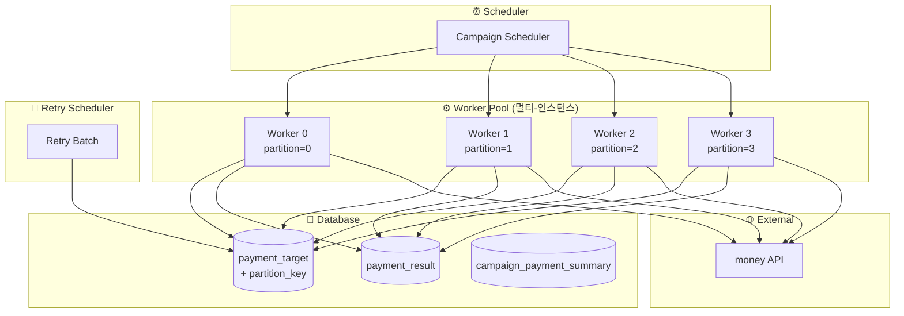
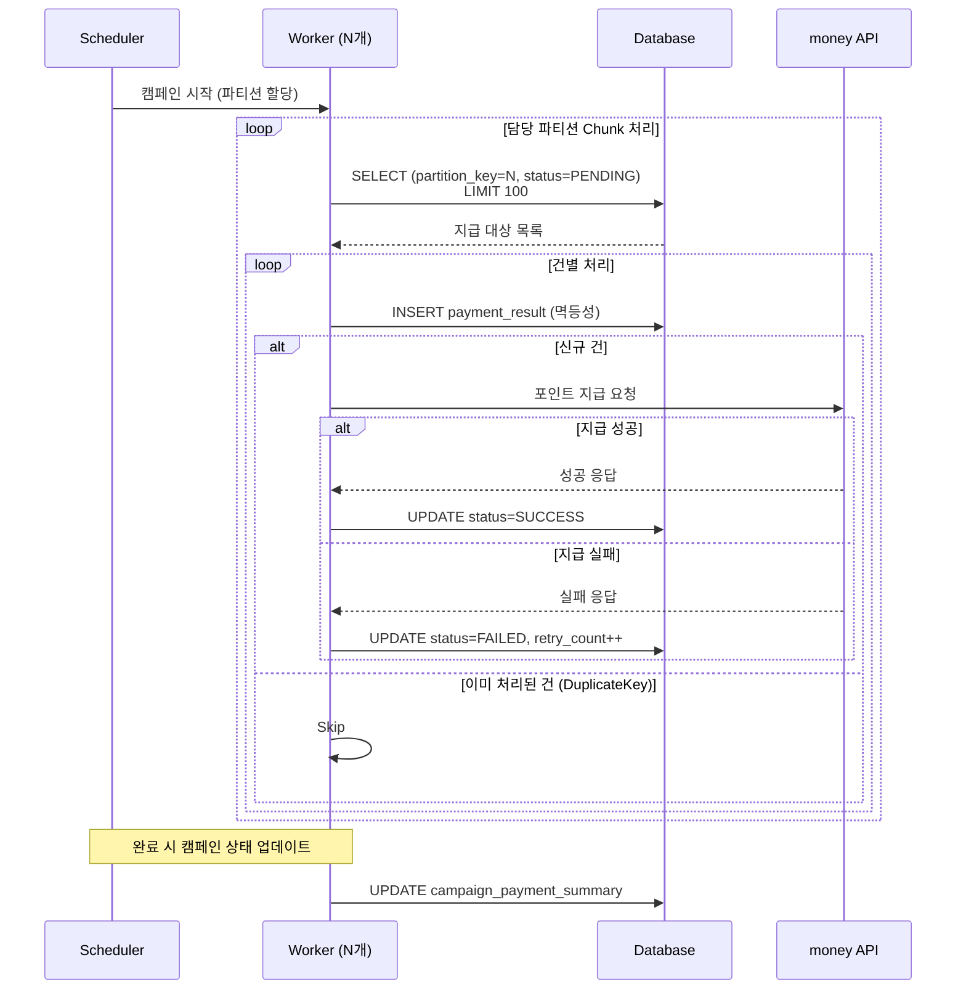
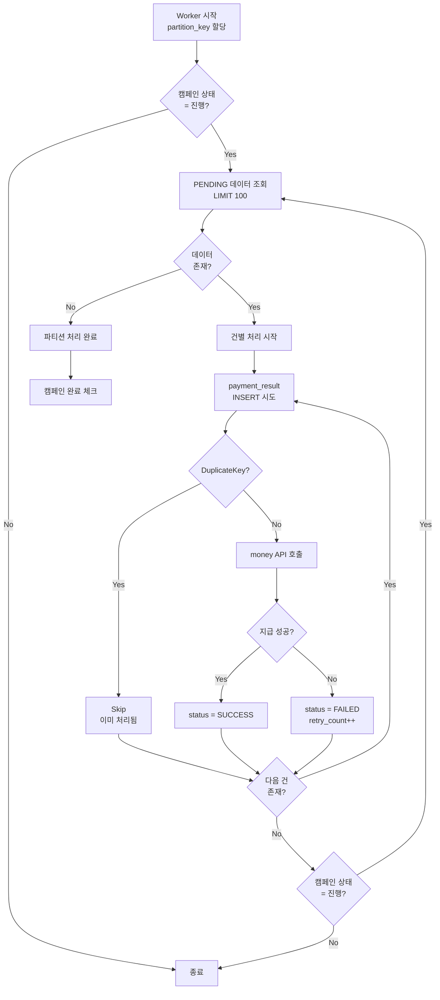
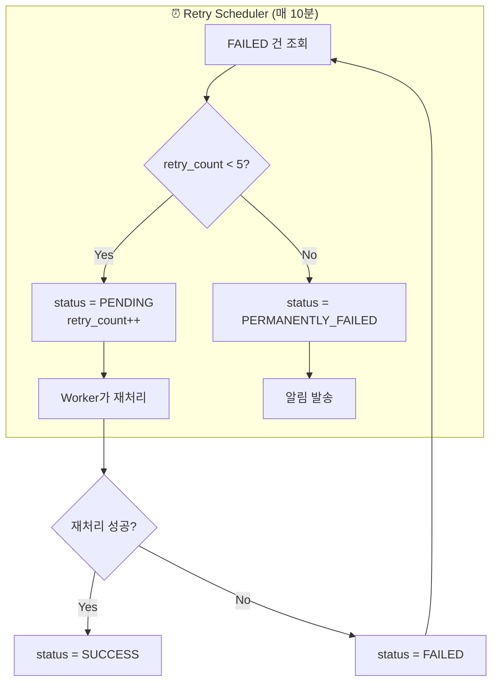
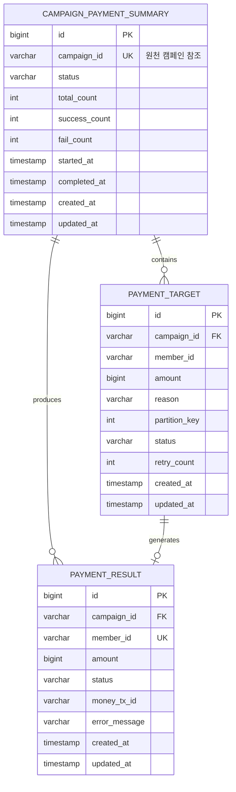
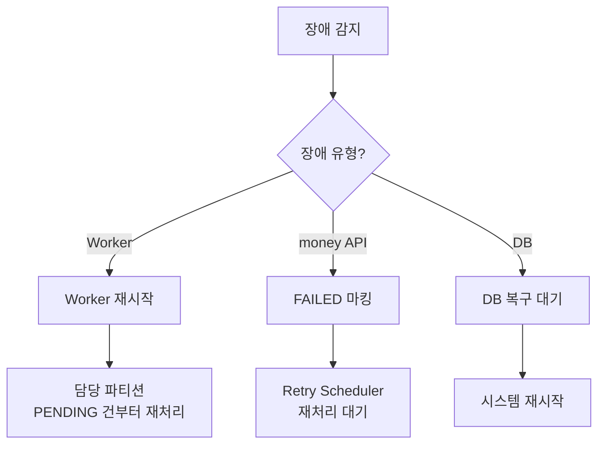

# 대량 포인트 지급 시스템 - 간소화 아키텍처

## 📌 Overview

### 설계 방향

> [!note] 간소화 버전
> Kafka 메시징 없이 **DB 기반 병렬 처리**로 단순하면서도 효과적인 대량 포인트 지급 시스템

```
┌─────────────────────────────────────────────────────────────┐
│  🎯 설계 목표                                                 │
├─────────────────────────────────────────────────────────────┤
│  ✅ 인프라 단순화 - Kafka 클러스터 운영 불필요               │
│  ✅ 운영 편의성 - DB만으로 상태 관리 및 모니터링             │
│  ✅ 비용 절감 - 메시지 브로커 인프라 비용 제거               │
│  ✅ 동일 성능 - 100만 건 약 17분 처리 (TPS 1000 기준)        │
└─────────────────────────────────────────────────────────────┘
```

### 고성능 버전과 비교

| 항목 | 고성능 버전 (Kafka) | 간소화 버전 (DB 기반) |
|------|:------------------:|:--------------------:|
| **메시지 브로커** | Kafka | ❌ 없음 |
| **병렬 처리** | Consumer Group | DB 파티셔닝 + Worker Pool |
| **재처리** | DLT 패턴 (실시간) | 배치 스케줄러 |
| **인프라 복잡도** | 높음 | 낮음 |
| **운영 복잡도** | Kafka 운영 필요 | DB만 관리 |
| **확장성** | 높음 | 중간 |
| **처리 성능** | ~17분 | ~17분 (동일) |

---

## 🏛️ High-Level Architecture

### 아키텍처 다이어그램



### 컴포넌트 역할

| 컴포넌트 | 역할 | 비고 |
|----------|------|------|
| **Scheduler** | 캠페인 시작/중단 트리거 | Worker에 파티션 할당 |
| **Worker Pool** | DB 조회 → money API 호출 | 멀티-인스턴스 병렬 처리 |
| **Database** | 상태 관리 및 멱등성 보장 | 단일 저장소 |
| **Retry Scheduler** | 실패 건 재처리 | 주기적 배치 |

---

## 🔄 처리 흐름

### 전체 시퀀스 다이어그램



### Worker 처리 흐름



---

## 🔀 병렬 처리 전략

### 파티션 기반 분배

```
┌─────────────────────────────────────────────────────────────┐
│  🔀 파티션 분배 (Worker 4개 기준)                            │
├─────────────────────────────────────────────────────────────┤
│  Worker 0: partition_key = 0  (약 25만 건)                  │
│  Worker 1: partition_key = 1  (약 25만 건)                  │
│  Worker 2: partition_key = 2  (약 25만 건)                  │
│  Worker 3: partition_key = 3  (약 25만 건)                  │
│                                                             │
│  ※ 각 Worker는 자신의 파티션만 처리 → 중복 조회 방지        │
│  ※ partition_key = hash(campaign_id + member_id) % 4       │
└─────────────────────────────────────────────────────────────┘
```

### 파티션 할당 방식

| 방식 | 설명 | 장점 | 단점 |
|------|------|------|------|
| **정적 할당** | Worker 시작 시 파티션 고정 할당 | 단순, 예측 가능 | 부하 불균형 가능 |
| **동적 할당** | Scheduler가 파티션 동적 분배 | 부하 균형 | 구현 복잡 |

> [!tip] 권장: 정적 할당
> 대량 데이터는 hash 분배로 자연스럽게 균등 분산되므로 정적 할당으로 충분합니다.

### Rate Limiting

```
┌─────────────────────────────────────────────────────────────┐
│  ⚡ Rate Limiting 설정                                       │
├─────────────────────────────────────────────────────────────┤
│                                                             │
│  money API TPS 제한: 1,000 TPS                              │
│                                                             │
│  Worker 4개 구성 시:                                        │
│  - Worker당 TPS: 250 TPS                                    │
│  - 총 TPS: 250 × 4 = 1,000 TPS                              │
│                                                             │
│  구현: Resilience4j RateLimiter                             │
│  - limitForPeriod: 250                                      │
│  - limitRefreshPeriod: 1s                                   │
│                                                             │
└─────────────────────────────────────────────────────────────┘
```

---

## 🔐 멱등성 보장 전략

### 단일 계층: DB Unique Constraint

```
┌─────────────────────────────────────────────────────────────┐
│  🔐 멱등성 보장 구조                                         │
├─────────────────────────────────────────────────────────────┤
│                                                             │
│  DB Unique Constraint (campaign_id + member_id)             │
│  → INSERT 시도 시 중복이면 DuplicateKeyException 발생       │
│  → 예외 처리로 Skip 하여 멱등성 보장                        │
│                                                             │
└─────────────────────────────────────────────────────────────┘
```

### 처리 로직

```
┌─────────────────────────────────────────────────────────────┐
│  ⚙️ Worker 멱등성 처리 로직                                  │
├─────────────────────────────────────────────────────────────┤
│                                                             │
│  1. payment_result INSERT 시도                              │
│     │                                                       │
│     ├─ 성공 → money API 호출 → 결과 UPDATE                  │
│     │                                                       │
│     └─ DuplicateKeyException → Skip (이미 처리됨)           │
│                                                             │
│  ※ 파티션 기반 분배로 동일 건 동시 처리 방지               │
│  ※ DB Unique 제약으로 최종 안전장치                        │
│                                                             │
└─────────────────────────────────────────────────────────────┘
```

---

## 🔄 재처리 프로세스 (배치 기반)

### 개요

> [!note] 배치 기반 재처리
> Kafka DLT 대신 **주기적 배치 스케줄러**로 실패 건 재처리

### 재처리 흐름



### 재처리 스케줄러 로직

```
┌─────────────────────────────────────────────────────────────┐
│  🔄 Retry Scheduler 로직                                     │
├─────────────────────────────────────────────────────────────┤
│                                                             │
│  [실행 주기] 매 10분                                        │
│                                                             │
│  [처리 로직]                                                │
│  1. FAILED 상태 & retry_count < 5 건 조회                   │
│  2. status = PENDING으로 변경 (retry_count++)               │
│  3. Worker가 다음 조회 시 재처리                            │
│                                                             │
│  [최종 실패 처리]                                           │
│  retry_count >= 5 → status = PERMANENTLY_FAILED            │
│  → Slack/Email 알림 발송                                    │
│                                                             │
└─────────────────────────────────────────────────────────────┘
```

### 재처리 쿼리

```sql
-- 재처리 대상 조회 및 상태 변경
UPDATE payment_target
SET status = 'PENDING',
    retry_count = retry_count + 1,
    updated_at = NOW()
WHERE campaign_id = :campaignId
  AND status = 'FAILED'
  AND retry_count < 5;

-- 최종 실패 처리
UPDATE payment_target
SET status = 'PERMANENTLY_FAILED',
    updated_at = NOW()
WHERE campaign_id = :campaignId
  AND status = 'FAILED'
  AND retry_count >= 5;
```

---

## 📊 데이터 모델

### ERD



### 테이블 DDL

```sql
-- 캠페인 지급 현황 테이블
CREATE TABLE campaign_payment_summary (
    id              BIGINT PRIMARY KEY AUTO_INCREMENT,
    campaign_id     VARCHAR(50) NOT NULL UNIQUE,
    status          VARCHAR(20) NOT NULL DEFAULT 'PENDING',
    total_count     INT DEFAULT 0,
    success_count   INT DEFAULT 0,
    fail_count      INT DEFAULT 0,
    started_at      TIMESTAMP NULL,
    completed_at    TIMESTAMP NULL,
    created_at      TIMESTAMP DEFAULT CURRENT_TIMESTAMP,
    updated_at      TIMESTAMP DEFAULT CURRENT_TIMESTAMP ON UPDATE CURRENT_TIMESTAMP,
    
    INDEX idx_status (status)
) COMMENT '캠페인 지급 현황';

-- 지급 대상 테이블
CREATE TABLE payment_target (
    id              BIGINT PRIMARY KEY AUTO_INCREMENT,
    campaign_id     VARCHAR(50) NOT NULL,
    member_id       VARCHAR(50) NOT NULL,
    amount          BIGINT NOT NULL,
    reason          VARCHAR(500),
    partition_key   INT NOT NULL,
    status          VARCHAR(20) DEFAULT 'PENDING',
    retry_count     INT DEFAULT 0,
    created_at      TIMESTAMP DEFAULT CURRENT_TIMESTAMP,
    updated_at      TIMESTAMP DEFAULT CURRENT_TIMESTAMP ON UPDATE CURRENT_TIMESTAMP,
    
    INDEX idx_partition_status (campaign_id, partition_key, status),
    INDEX idx_retry (campaign_id, status, retry_count)
);

-- 지급 결과 테이블
CREATE TABLE payment_result (
    id              BIGINT PRIMARY KEY AUTO_INCREMENT,
    campaign_id     VARCHAR(50) NOT NULL,
    member_id       VARCHAR(50) NOT NULL,
    amount          BIGINT NOT NULL,
    status          VARCHAR(20) NOT NULL,
    money_tx_id     VARCHAR(100),
    error_message   VARCHAR(500),
    created_at      TIMESTAMP DEFAULT CURRENT_TIMESTAMP,
    updated_at      TIMESTAMP DEFAULT CURRENT_TIMESTAMP ON UPDATE CURRENT_TIMESTAMP,
    
    UNIQUE KEY uk_idempotency (campaign_id, member_id),
    INDEX idx_status (campaign_id, status)
);
```

### 상태 정의

#### Campaign Payment Status

| 상태 | 설명 |
|:----:|------|
| `PENDING` | 캠페인 생성됨, 지급 대기 |
| `RUNNING` | 지급 진행 중 |
| `COMPLETED` | 지급 완료 (부분 실패 포함) |
| `FAILED` | 시스템 장애로 실패 |
| `STOPPED` | 수동 중단 |

#### Payment Status

| 상태 | 설명 |
|:----:|------|
| `PENDING` | 처리 대기 |
| `SUCCESS` | 지급 성공 |
| `FAILED` | 지급 실패 (재처리 대상) |
| `PERMANENTLY_FAILED` | 재처리 한도 초과 |

---

## 📈 예상 성능

### 성능 산정 기준

| 항목 | 값 | 비고 |
|------|-----|------|
| 총 지급 대상 | 1,000,000 건 | 최대 기준 |
| money API TPS | 1,000 TPS | API 제한 |
| Worker 수 | 4개 | 멀티-인스턴스 |
| Worker당 TPS | 250 TPS | Rate Limiting |
| Chunk 크기 | 100건 | DB 조회 단위 |

### 처리 시간 산정

```
┌─────────────────────────────────────────────────────────────┐
│  ⏱️ 처리 시간 계산                                           │
├─────────────────────────────────────────────────────────────┤
│                                                             │
│  총 처리 시간 = 총 건수 / 총 TPS                            │
│             = 1,000,000 / 1,000                             │
│             = 1,000초                                       │
│             = 약 17분                                       │
│                                                             │
└─────────────────────────────────────────────────────────────┘
```

### 확장성

```
┌─────────────────────────────────────────────────────────────┐
│  📊 Worker 수에 따른 처리 시간                               │
├─────────────────────────────────────────────────────────────┤
│                                                             │
│  Worker 4개  (파티션 4개)  : 약 17분                        │
│  Worker 8개  (파티션 8개)  : 약 8분  (money API 2000 TPS)   │
│  Worker 16개 (파티션 16개) : 약 4분  (money API 4000 TPS)   │
│                                                             │
│  ※ money API TPS 제한이 최종 bottleneck                    │
│  ※ Worker 확장 시 파티션 수도 함께 조정 필요               │
│                                                             │
└─────────────────────────────────────────────────────────────┘
```

---

## ⚠️ 장애 대응

### 장애 시나리오 및 대응

| 장애 상황 | 영향 | 대응 |
|----------|------|------|
| **Worker 장애** | 해당 파티션 처리 중단 | Worker 재시작, PENDING 건부터 재처리 |
| **money API 장애** | 지급 실패 | FAILED 마킹 → 재처리 배치에서 처리 |
| **DB 장애** | 전체 중단 | DB 복구 후 재시작 |

### 복구 프로세스



---

## 🔧 구현 가이드

### Worker 구현 예시 (Spring Boot)

```
┌─────────────────────────────────────────────────────────────┐
│  ⚙️ Worker 구현 구조                                         │
├─────────────────────────────────────────────────────────────┤
│                                                             │
│  @Component                                                 │
│  class PaymentWorker {                                      │
│                                                             │
│      @Value("${worker.partition-key}")                      │
│      int partitionKey;                                      │
│                                                             │
│      @Scheduled(fixedDelay = 1000)                          │
│      void process() {                                       │
│          // 1. PENDING 건 조회 (partition_key 기준)         │
│          // 2. 건별 처리                                    │
│          //    - payment_result INSERT (멱등성)            │
│          //    - money API 호출                            │
│          //    - 결과 UPDATE                               │
│      }                                                      │
│  }                                                          │
│                                                             │
└─────────────────────────────────────────────────────────────┘
```

### 배포 구성

```
┌─────────────────────────────────────────────────────────────┐
│  🚀 배포 구성 (Kubernetes 예시)                              │
├─────────────────────────────────────────────────────────────┤
│                                                             │
│  Deployment: payment-worker                                 │
│  - replicas: 4                                              │
│  - env:                                                     │
│      WORKER_PARTITION_KEY: "0" ~ "3" (각 Pod별 다름)       │
│      RATE_LIMIT_TPS: "250"                                  │
│                                                             │
│  StatefulSet 또는 Pod별 ConfigMap으로 파티션 할당           │
│                                                             │
└─────────────────────────────────────────────────────────────┘
```

---

## 📎 부록: 고성능 버전과 선택 기준

### 언제 간소화 버전을 선택할까?

| 상황 | 권장 버전 |
|------|----------|
| Kafka 인프라가 없거나 운영 부담 | ✅ **간소화 버전** |
| 처리량이 100만 건 이하 | ✅ **간소화 버전** |
| 빠른 개발/배포 필요 | ✅ **간소화 버전** |
| 실시간 재처리 필요 | ❌ 고성능 버전 |
| 처리량이 수천만 건 이상 | ❌ 고성능 버전 |
| Publisher/Consumer 독립 확장 필요 | ❌ 고성능 버전 |

### 마이그레이션 경로

```
┌─────────────────────────────────────────────────────────────┐
│  🔄 간소화 → 고성능 마이그레이션                             │
├─────────────────────────────────────────────────────────────┤
│                                                             │
│  간소화 버전으로 시작 → 요구사항 증가 시 고성능으로 전환    │
│                                                             │
│  [유지되는 것]                                              │
│  - 데이터 모델 (동일)                                       │
│  - 멱등성 전략 (DB Unique)                                  │
│  - 파티션 키 전략 (동일)                                    │
│                                                             │
│  [변경되는 것]                                              │
│  - Worker → Publisher + Consumer 분리                       │
│  - 배치 재처리 → DLT 재처리                                 │
│  - Kafka 인프라 추가                                        │
│                                                             │
└─────────────────────────────────────────────────────────────┘
```

---

## 🏗️ 다음 단계

### 설계 완료 항목

- [x] High-Level Architecture 설계
- [x] 처리 흐름 설계
- [x] 병렬 처리 전략 수립
- [x] 멱등성 보장 전략 수립
- [x] 데이터 모델 설계
- [x] 재처리 프로세스 설계
- [x] 예상 성능 분석
- [x] 장애 대응 방안

### 추후 작업

- [ ] API Spec 정의
- [ ] 모니터링 대시보드 설계
- [ ] Worker 구현
- [ ] 배포 스크립트 작성
