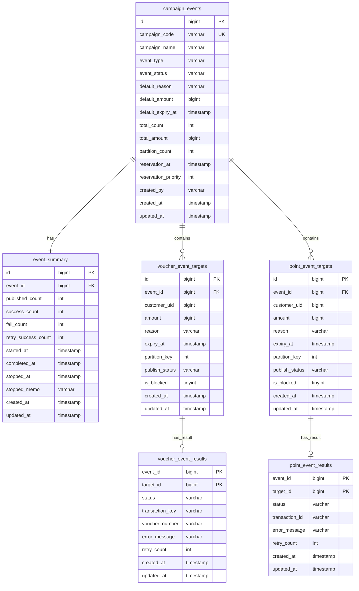

# 대량 포인트 지급 시스템 데이터 모델링

## 📋 테이블 목록

### 공통 레이어
| 테이블               | 설명         |
| ----------------- | ---------- |
| `campaign_events` | 캠페인 이벤트 정보 |
| `event_summary`   | 이벤트 처리 현황  |
### 이벤트 상품권 발행 도메인
| 테이블                     | 설명            |
| ----------------------- | ------------- |
| `voucher_event_targets` | 상품권 이벤트 처리 대상 |
| `voucher_event_results` | 상품권 이벤트 처리 결과 |

### 이벤트 포인트 지급 도메인
| 테이블                   | 설명            |
| --------------------- | ------------- |
| `point_event_targets` | 포인트 이벤트 처리 대상 |
| `point_event_results` | 포인트 이벤트 처리 결과 |

---

## 📊 ERD



---

## 📝 테이블 상세 정의

### 1️⃣ `campaign_events` (캠페인 이벤트 목록)

> 캠페인 이벤트에 대한 정의/설정 정보를 저장하는 메타 테이블

#### 요구 사항
- 캠페인 처리할 이벤트 구분 정보 관리
	- 포인트 지급 (`POINT`)
	- 상품권 발행 (`VOUCHER`)
	- 이벤트 구분은 동적으로 추가 가능
- 이벤트 메타 정보 관리
	- 총 대상 건수
	- 총 지급/발행 금액
	- 포인트/상품권 만료 일시
- 공통 사유(`default_reason`) 정보 저장
	- 각 요청 별 개별 사유가 없다면 해당 공통 사유를 `money` 서비스로 전달
- 캠페인 이벤트 예약 정보 관리
	- 시작 예약 일시
	- 예약 우선 순위 (동시간 복수 이벤트 시 순차 처리)
- 캠페인 이벤트 진행 상태 정보 관리 (비정규화)
	- `PENDING`: 대기
	- `RUNNING`: 진행 중
	- `COMPLETED`: 완료
	- `STOPPED`: 수동 중단
	- `FAILED`: 시스템 장애

#### 컬럼 정의

| Column | Type | Nullable | Description |
|--------|------|:--------:|-------------|
| `id` | BIGINT | NO | 이벤트 ID (PK, AUTO_INCREMENT) |
| `campaign_id` | VARCHAR(50) | NO | 캠페인 ID (UK, 원천 캠페인 참조) |
| `event_type` | VARCHAR(20) | NO | 이벤트 구분 (`POINT` / `VOUCHER`) |
| `event_status` | VARCHAR(20) | NO | 이벤트 상태 |
| `default_reason` | VARCHAR(500) | YES | 공통 사유 |
| `default_amount` | BIGINT | YES | 기본 금액 |
| `default_expiry_at` | TIMESTAMP | YES | 기본 만료 일시 (포인트/상품권) |
| `total_count` | INT | NO | 전체 대상 건수 |
| `total_amount` | BIGINT | NO | 전체 금액 |
| `partition_count` | INT | NO | 병렬 처리 파티션 수 (기본값: 4) |
| `reservation_at` | TIMESTAMP | YES | 예약 일시 |
| `reservation_priority` | INT | YES | 예약 우선 순위 (낮을수록 우선) |
| `created_by` | VARCHAR(50) | NO | 생성자 (관리자) |
| `created_at` | TIMESTAMP | NO | 생성 일시 |
| `updated_at` | TIMESTAMP | NO | 수정 일시 |

#### DDL

```sql
CREATE TABLE campaign_events (
    id                   BIGINT PRIMARY KEY AUTO_INCREMENT,
    campaign_id          VARCHAR(50) NOT NULL UNIQUE COMMENT '원천 캠페인 참조 키',
    event_type           VARCHAR(20) NOT NULL COMMENT 'POINT / VOUCHER',
    event_status         VARCHAR(20) NOT NULL DEFAULT 'PENDING',
    default_reason       VARCHAR(500) NULL COMMENT '공통 사유',
    default_amount       BIGINT NULL COMMENT '기본 금액',
    default_expiry_at    TIMESTAMP NULL COMMENT '기본 만료 일시',
    total_count          INT NOT NULL DEFAULT 0,
    total_amount         BIGINT NOT NULL DEFAULT 0,
    partition_count      INT NOT NULL DEFAULT 4 COMMENT '병렬 처리 파티션 수',
    reservation_at       TIMESTAMP NULL COMMENT '예약 일시',
    reservation_priority INT NULL COMMENT '예약 우선 순위 (낮을수록 우선)',
    created_by           VARCHAR(50) NOT NULL COMMENT '생성자',
    created_at           TIMESTAMP NOT NULL DEFAULT CURRENT_TIMESTAMP,
    updated_at           TIMESTAMP NOT NULL DEFAULT CURRENT_TIMESTAMP ON UPDATE CURRENT_TIMESTAMP,
    
    INDEX idx_status (event_status),
    INDEX idx_reservation (reservation_at, reservation_priority)
) COMMENT '캠페인 이벤트 메타';
```

---

### 2️⃣ `campaign_event_summary` (이벤트 처리 현황)

> 캠페인 이벤트 실행 현황을 저장하는 테이블 (런타임 데이터)

#### 요구 사항
- 실시간 처리 현황 카운트 관리
	- 발행 완료 건수 (Kafka 발행)
	- 성공 건수
	- 최종 실패 건수 (재시도 한도 초과)
	- 재시도 성공 건수
- 이벤트 실행 시간 정보 관리
	- 시작 일시
	- 완료 일시
	- 중지 일시 및 사유

#### 컬럼 정의

| Column | Type | Nullable | Description |
|--------|------|:--------:|-------------|
| `id` | BIGINT | NO | 현황 ID (PK, AUTO_INCREMENT) |
| `event_id` | BIGINT | NO | campaign_events.id (FK, UK) |
| `published_count` | INT | NO | Kafka 발행 완료 건수 |
| `success_count` | INT | NO | 성공 건수 |
| `fail_count` | INT | NO | 최종 실패 건수 |
| `retry_success_count` | INT | NO | 재시도 성공 건수 |
| `started_at` | TIMESTAMP | YES | 시작 일시 |
| `completed_at` | TIMESTAMP | YES | 완료 일시 |
| `stopped_at` | TIMESTAMP | YES | 중지 일시 |
| `stopped_memo` | VARCHAR(500) | YES | 중지 사유 |
| `created_at` | TIMESTAMP | NO | 생성 일시 |
| `updated_at` | TIMESTAMP | NO | 수정 일시 |

#### DDL

```sql
CREATE TABLE campaign_event_summary (
    id                  BIGINT PRIMARY KEY AUTO_INCREMENT,
    event_id            BIGINT NOT NULL UNIQUE COMMENT 'campaign_events.id 참조',
    published_count     INT NOT NULL DEFAULT 0 COMMENT 'Kafka 발행 완료 건수',
    success_count       INT NOT NULL DEFAULT 0 COMMENT '성공 건수',
    fail_count          INT NOT NULL DEFAULT 0 COMMENT '최종 실패 건수',
    retry_success_count INT NOT NULL DEFAULT 0 COMMENT '재시도 성공 건수',
    started_at          TIMESTAMP NULL COMMENT '시작 일시',
    completed_at        TIMESTAMP NULL COMMENT '완료 일시',
    stopped_at          TIMESTAMP NULL COMMENT '중지 일시',
    stopped_memo        VARCHAR(500) NULL COMMENT '중지 사유',
    created_at          TIMESTAMP NOT NULL DEFAULT CURRENT_TIMESTAMP,
    updated_at          TIMESTAMP NOT NULL DEFAULT CURRENT_TIMESTAMP ON UPDATE CURRENT_TIMESTAMP,
    
    CONSTRAINT fk_summary_event FOREIGN KEY (event_id) REFERENCES campaign_events(id)
) COMMENT '캠페인 이벤트 처리 현황';
```

---

### 3️⃣ `event_point_targets` (포인트 지급 대상)

> 포인트 지급 대상자 목록을 저장하는 테이블

#### 요구 사항
- 포인트 지급 대상 회원 정보 관리
- 건별 지급 금액 및 사유 관리
- 포인트 만료 일시 관리 (메시지 발행 시 포함)
- 병렬 처리를 위한 파티션 키 관리
- Kafka 발행 상태 관리
- 처리 차단 여부 관리 (잘못된 대상 제외)

#### 컬럼 정의

| Column | Type | Nullable | Description |
|--------|------|:--------:|-------------|
| `id` | BIGINT | NO | 대상 ID (PK, AUTO_INCREMENT) |
| `event_id` | BIGINT | NO | campaign_events.id (FK) |
| `member_id` | VARCHAR(50) | NO | 회원 ID |
| `amount` | BIGINT | NO | 지급 금액 |
| `reason` | VARCHAR(500) | YES | 개별 사유 (NULL이면 default_reason 사용) |
| `expiry_at` | TIMESTAMP | YES | 포인트 만료 일시 |
| `partition_key` | INT | NO | 파티션 키 (0 ~ partition_count-1) |
| `publish_status` | VARCHAR(20) | NO | 발행 상태 (`PENDING` / `PUBLISHED`) |
| `is_blocked` | TINYINT(1) | NO | 차단 여부 (1: 차단, 0: 정상) |
| `created_at` | TIMESTAMP | NO | 생성 일시 |
| `updated_at` | TIMESTAMP | NO | 수정 일시 |

#### DDL

```sql
CREATE TABLE event_point_targets (
    id             BIGINT PRIMARY KEY AUTO_INCREMENT,
    event_id       BIGINT NOT NULL COMMENT 'campaign_events.id 참조',
    member_id      VARCHAR(50) NOT NULL COMMENT '회원 ID',
    amount         BIGINT NOT NULL COMMENT '지급 금액',
    reason         VARCHAR(500) NULL COMMENT '개별 사유',
    expiry_at      TIMESTAMP NULL COMMENT '포인트 만료 일시',
    partition_key  INT NOT NULL COMMENT '파티션 키',
    publish_status VARCHAR(20) NOT NULL DEFAULT 'PENDING' COMMENT 'PENDING / PUBLISHED',
    is_blocked     TINYINT(1) NOT NULL DEFAULT 0 COMMENT '차단 여부',
    created_at     TIMESTAMP NOT NULL DEFAULT CURRENT_TIMESTAMP,
    updated_at     TIMESTAMP NOT NULL DEFAULT CURRENT_TIMESTAMP ON UPDATE CURRENT_TIMESTAMP,
    
    UNIQUE KEY uk_event_member (event_id, member_id),
    INDEX idx_partition_publish (event_id, partition_key, publish_status, is_blocked),
    CONSTRAINT fk_event_point_target FOREIGN KEY (event_id) REFERENCES campaign_events(id)
) COMMENT '포인트 지급 대상';
```

---

### 4️⃣ `event_point_results` (포인트 지급 결과)

> 포인트 지급 처리 결과를 저장하는 테이블 (멱등성 보장)

#### 요구 사항
- 복합 PK를 통한 멱등성 보장 (event_id + target_id)
- 지급 처리 결과 상태 관리
- money 시스템 트랜잭션 ID 저장
- 실패 시 에러 메시지 저장
- 재시도 횟수 관리

#### 컬럼 정의

| Column          | Type         | Nullable | Description                               |
| --------------- | ------------ | :------: | ----------------------------------------- |
| `event_id`      | BIGINT       |    NO    | campaign_events.id (PK)                   |
| `target_id`     | BIGINT       |    NO    | event_point_targets.id (PK)               |
| `status`        | VARCHAR(20)  |    NO    | 처리 상태                                   |
| `money_tx_id`   | VARCHAR(100) |   YES    | money 트랜잭션 ID                           |
| `error_message` | VARCHAR(500) |   YES    | 에러 메시지                                  |
| `retry_count`   | INT          |    NO    | 재시도 횟수                                  |
| `created_at`    | TIMESTAMP    |    NO    | 생성 일시                                   |
| `updated_at`    | TIMESTAMP    |    NO    | 수정 일시                                   |

#### 상태 정의

| Status | Description |
|:------:|-------------|
| `PENDING` | 처리 대기 |
| `SUCCESS` | 지급 성공 |
| `FAILED` | 지급 실패 (DLT 재처리 대상) |
| `PERMANENTLY_FAILED` | 최종 실패 (재시도 한도 초과) |

#### DDL

```sql
CREATE TABLE event_point_results (
    event_id      BIGINT NOT NULL COMMENT 'campaign_events.id 참조',
    target_id     BIGINT NOT NULL COMMENT 'event_point_targets.id 참조',
    status        VARCHAR(20) NOT NULL DEFAULT 'PENDING',
    money_tx_id   VARCHAR(100) NULL COMMENT 'money 시스템 트랜잭션 ID',
    error_message VARCHAR(500) NULL COMMENT '에러 메시지',
    retry_count   INT NOT NULL DEFAULT 0 COMMENT '재시도 횟수',
    created_at    TIMESTAMP NOT NULL DEFAULT CURRENT_TIMESTAMP,
    updated_at    TIMESTAMP NOT NULL DEFAULT CURRENT_TIMESTAMP ON UPDATE CURRENT_TIMESTAMP,
    
    PRIMARY KEY (event_id, target_id),
    INDEX idx_status (event_id, status)
) COMMENT '포인트 지급 결과';
```

---

### 5️⃣ `event_voucher_targets` (상품권 발행 대상)

> 상품권 발행 대상자 목록을 저장하는 테이블

#### 요구 사항
- 상품권 발행 대상 회원 정보 관리
- 건별 발행 금액 및 사유 관리
- 상품권 만료 일시 관리 (메시지 발행 시 포함)
- 병렬 처리를 위한 파티션 키 관리
- Kafka 발행 상태 관리
- 처리 차단 여부 관리 (잘못된 대상 제외)

#### 컬럼 정의

| Column           | Type         | Nullable | Description                      |
| ---------------- | ------------ | :------: | -------------------------------- |
| `id`             | BIGINT       |    NO    | 대상 ID (PK, AUTO_INCREMENT)       |
| `event_id`       | BIGINT       |    NO    | campaign_events.id (FK)          |
| `member_id`      | VARCHAR(50)  |    NO    | 회원 ID                            |
| `amount`         | BIGINT       |    NO    | 발행 금액                            |
| `reason`         | VARCHAR(500) |   YES    | 개별 사유 (NULL이면 default_reason 사용) |
| `expiry_at`      | TIMESTAMP    |   YES    | 상품권 만료 일시                        |
| `partition_key`  | INT          |    NO    | 파티션 키 (0 ~ partition_count-1)    |
| `publish_status` | VARCHAR(20)  |    NO    | 발행 상태 (`PENDING` / `PUBLISHED`)  |
| `is_blocked`     | TINYINT(1)   |    NO    | 차단 여부 (1: 차단, 0: 정상)             |
| `created_at`     | TIMESTAMP    |    NO    | 생성 일시                            |
| `updated_at`     | TIMESTAMP    |    NO    | 수정 일시                            |

#### DDL

```sql
CREATE TABLE event_voucher_targets (
    id             BIGINT PRIMARY KEY AUTO_INCREMENT,
    event_id       BIGINT NOT NULL COMMENT 'campaign_events.id 참조',
    member_id      VARCHAR(50) NOT NULL COMMENT '회원 ID',
    amount         BIGINT NOT NULL COMMENT '발행 금액',
    reason         VARCHAR(500) NULL COMMENT '개별 사유',
    expiry_at      TIMESTAMP NULL COMMENT '상품권 만료 일시',
    partition_key  INT NOT NULL COMMENT '파티션 키',
    publish_status VARCHAR(20) NOT NULL DEFAULT 'PENDING' COMMENT 'PENDING / PUBLISHED',
    is_blocked     TINYINT(1) NOT NULL DEFAULT 0 COMMENT '차단 여부',
    created_at     TIMESTAMP NOT NULL DEFAULT CURRENT_TIMESTAMP,
    updated_at     TIMESTAMP NOT NULL DEFAULT CURRENT_TIMESTAMP ON UPDATE CURRENT_TIMESTAMP,
    
    UNIQUE KEY uk_event_member (event_id, member_id),
    INDEX idx_partition_publish (event_id, partition_key, publish_status, is_blocked),
    CONSTRAINT fk_event_voucher_target FOREIGN KEY (event_id) REFERENCES campaign_events(id)
) COMMENT '상품권 발행 대상';
```

---

### 6️⃣ `event_voucher_results` (상품권 발행 결과)

> 상품권 발행 처리 결과를 저장하는 테이블 (멱등성 보장)

#### 요구 사항
- 복합 PK를 통한 멱등성 보장 (event_id + target_id)
- 발행 처리 결과 상태 관리
- money 시스템 트랜잭션 ID 저장
- 상품권 코드, PIN, 만료일 저장
- 실패 시 에러 메시지 저장
- 재시도 횟수 관리

#### 컬럼 정의

| Column              | Type         | Nullable | Description                               |
| ------------------- | ------------ | :------: | ----------------------------------------- |
| `event_id`          | BIGINT       |    NO    | campaign_events.id (PK)                   |
| `target_id`         | BIGINT       |    NO    | event_voucher_targets.id (PK)             |
| `status`            | VARCHAR(20)  |    NO    | 처리 상태                                     |
| `money_tx_id`       | VARCHAR(100) |   YES    | money 트랜잭션 ID                             |
| `voucher_code`      | VARCHAR(50)  |   YES    | 상품권 코드                                    |
| `voucher_pin`       | VARCHAR(20)  |   YES    | 상품권 PIN                                   |
| `voucher_expiry_at` | TIMESTAMP    |   YES    | 상품권 만료 일시 (발행 시 반환값)                      |
| `error_message`     | VARCHAR(500) |   YES    | 에러 메시지                                    |
| `retry_count`       | INT          |    NO    | 재시도 횟수                                    |
| `created_at`        | TIMESTAMP    |    NO    | 생성 일시                                     |
| `updated_at`        | TIMESTAMP    |    NO    | 수정 일시                                     |

#### 상태 정의

| Status | Description |
|:------:|-------------|
| `PENDING` | 처리 대기 |
| `SUCCESS` | 발행 성공 |
| `FAILED` | 발행 실패 (DLT 재처리 대상) |
| `PERMANENTLY_FAILED` | 최종 실패 (재시도 한도 초과) |

#### DDL

```sql
CREATE TABLE event_voucher_results (
    event_id          BIGINT NOT NULL COMMENT 'campaign_events.id 참조',
    target_id         BIGINT NOT NULL COMMENT 'event_voucher_targets.id 참조',
    status            VARCHAR(20) NOT NULL DEFAULT 'PENDING',
    money_tx_id       VARCHAR(100) NULL COMMENT 'money 시스템 트랜잭션 ID',
    voucher_code      VARCHAR(50) NULL COMMENT '상품권 코드',
    voucher_pin       VARCHAR(20) NULL COMMENT '상품권 PIN',
    voucher_expiry_at TIMESTAMP NULL COMMENT '상품권 만료 일시 (발행 시 반환값)',
    error_message     VARCHAR(500) NULL COMMENT '에러 메시지',
    retry_count       INT NOT NULL DEFAULT 0 COMMENT '재시도 횟수',
    created_at        TIMESTAMP NOT NULL DEFAULT CURRENT_TIMESTAMP,
    updated_at        TIMESTAMP NOT NULL DEFAULT CURRENT_TIMESTAMP ON UPDATE CURRENT_TIMESTAMP,
    
    PRIMARY KEY (event_id, target_id),
    INDEX idx_status (event_id, status)
) COMMENT '상품권 발행 결과';
```

---

## 📎 부록

### 테이블 역할 구분

| 구분      | 테이블                      | 역할           | 변경 빈도              |
| ------- | ------------------------ | ------------ | ------------------ |
| **공통**  | `campaign_events`        | 정의/설정 (What) | 거의 없음              |
| **공통**  | `campaign_event_summary` | 실행 현황 (How)  | 자주 업데이트            |
| **포인트** | `event_point_targets`    | 지급 대상        | 생성 후 상태만 변경        |
| **포인트** | `event_point_results`    | 지급 결과        | 처리 시 INSERT/UPDATE |
| **상품권** | `event_voucher_targets`  | 발행 대상        | 생성 후 상태만 변경        |
| **상품권** | `event_voucher_results`  | 발행 결과        | 처리 시 INSERT/UPDATE |

### partition_key 생성 규칙

```sql
-- INSERT 시 계산 (권장)
INSERT INTO point_targets (event_id, member_id, amount, partition_key, ...)
VALUES (
    @event_id,
    @member_id,
    @amount,
    MOD(ABS(CRC32(CONCAT(@event_id, @member_id))), @partition_count),
    ...
);
```

> **Note**: `partition_count`는 `campaign_events.partition_count` 값을 참조
