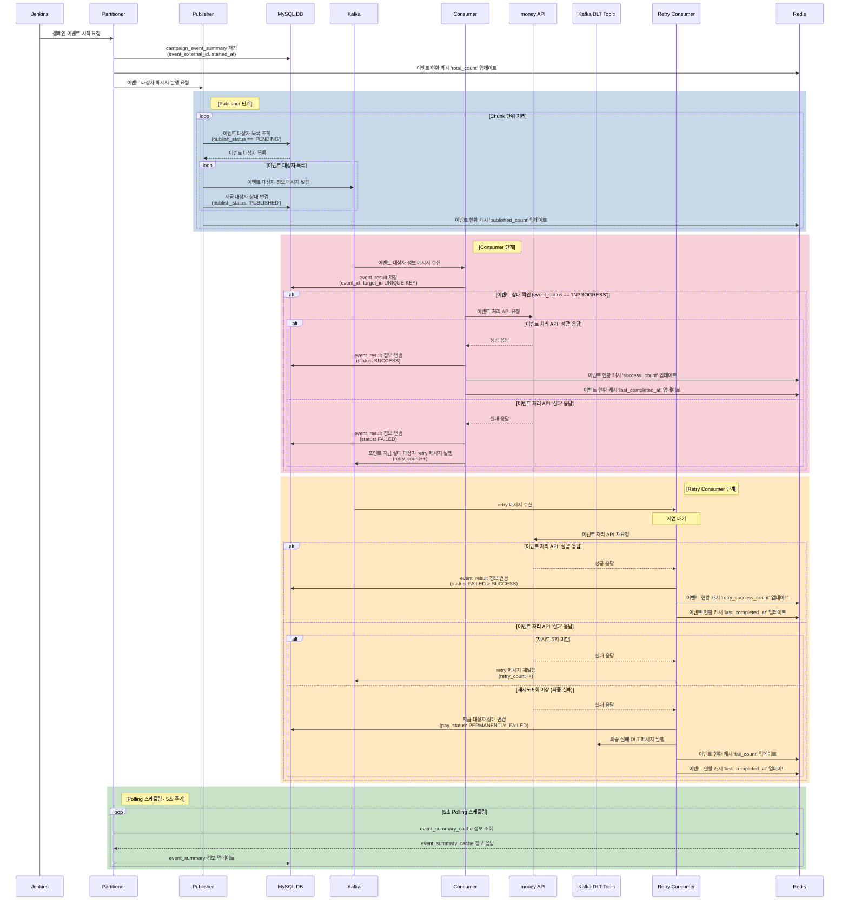

# 캠페인 이벤트 포인트/상품권 지급 시스템 시퀀스 다이어그램  
  
## Mermaid 시퀀스 다이어그램  
  

  
---  
  
## 상세 흐름 설명  
  
### 1단계: 이벤트 시작 및 초기화  
  
| 순서  | 발신자         | 수신자         | 동작                                                          |     |
| :-: | ----------- | ----------- | ----------------------------------------------------------- | --- |
|  1  | Jenkins     | Partitioner | 캠페인 이벤트 시작 요청                                               |     |
|  2  | Partitioner | MySQL DB    | `campaign_event_summary` 저장 (event_external_id, started_at) |     |
|  3  | Partitioner | Redis       | 이벤트 현황 캐시 `total_count` 업데이트                                |     |
|  4  | Partitioner | Publisher   | 이벤트 대상자 메시지 발행 요청                                           |     |
  
---  
  
### 2단계: Publisher - 메시지 발행 (Chunk 단위)  
  
| 순서 | 발신자 | 수신자 | 동작 |  
|:---:|--------|--------|------|  
| 5 | Publisher | MySQL DB | 이벤트 대상자 목록 조회 (`publish_status == 'PENDING'`) |  
| 6 | MySQL DB | Publisher | 이벤트 대상자 목록 반환 |  
| 7 | Publisher | Kafka | 이벤트 대상자 정보 메시지 발행 |  
| 8 | Publisher | MySQL DB | 지급 대상자 상태 변경 (`publish_status: 'PUBLISHED'`) |  
| 9 | Publisher | Redis | 이벤트 현황 캐시 `published_count` 업데이트 |  
  
**메시지 포맷:**  
  
```json  
// 포인트 이벤트 대상자 Message  
{  
  "event_id": "1",  
  "point_event_target_id": "1",  
  "customer_uid": "12345",  
  "amount": "50000",  
  "expiry_at": "20260131235959",  
  "reason": "새해맞이 이벤트 포인트 지급",  
  "partition_key": "0"  
}  
  
// 상품권 이벤트 대상자 Message  
{  
  "event_id": "1",  
  "voucher_event_target_id": "1",  
  "customer_uid": "12345",  
  "voucher_number": "voucher_number",  
  "reason": "새해맞이 이벤트 상품권 지급",  
  "partition_key": "0"  
}  
```  
  
---  
  
### 3단계: Consumer - 메시지 소비 및 API 호출  
  
| 순서 | 발신자 | 수신자 | 동작 |  
|:---:|--------|--------|------|  
| 10 | Kafka | Consumer | 이벤트 대상자 정보 메시지 수신 |  
| 11 | Consumer | MySQL DB | `event_result` 저장 (event_id, target_id UNIQUE KEY) |  
| 12 | Consumer | - | 이벤트 상태 확인 (`event_status == 'INPROGRESS'`) |  
| 13 | Consumer | money API | 이벤트 처리 API 요청 |  
  
#### 성공 시:  
| 순서 | 발신자 | 수신자 | 동작 |  
|:---:|--------|--------|------|  
| 14 | money API | Consumer | 이벤트 처리 API '성공' 응답 |  
| 15 | Consumer | MySQL DB | `event_result` 정보 변경 (`status: SUCCESS`) |  
| 16 | Consumer | Redis | 이벤트 현황 캐시 `success_count` 업데이트 |  
| 17 | Consumer | Redis | 이벤트 현황 캐시 `last_completed_at` 업데이트 |  
  
#### 실패 시:  
| 순서 | 발신자 | 수신자 | 동작 |  
|:---:|--------|--------|------|  
| 14 | money API | Consumer | 이벤트 처리 API '실패' 응답 |  
| 15 | Consumer | MySQL DB | `event_result` 정보 변경 (`status: FAILED`) |  
| 16 | Consumer | Kafka | 포인트 지급 실패 대상자 retry 메시지 발행 (`retry_count++`) |  
  
---  
  
### 4단계: Retry Consumer - 재시도 처리  
  
| 순서 | 발신자 | 수신자 | 동작 |  
|:---:|--------|--------|------|  
| 17 | Kafka | Retry Consumer | retry 메시지 수신 |  
| 18 | Retry Consumer | - | 지연 대기 |  
| 19 | Retry Consumer | money API | 이벤트 처리 API 재요청 |  
  
#### 재시도 성공 시:  
| 순서 | 발신자 | 수신자 | 동작 |  
|:---:|--------|--------|------|  
| 20 | money API | Retry Consumer | 이벤트 처리 API '성공' 응답 |  
| 21 | Retry Consumer | MySQL DB | `event_result` 정보 변경 (`status: FAILED > SUCCESS`) |  
| 22 | Retry Consumer | Redis | 이벤트 현황 캐시 `retry_success_count` 업데이트 |  
| 23 | Retry Consumer | Redis | 이벤트 현황 캐시 `last_completed_at` 업데이트 |  
  
#### 재시도 실패 시 (5회 미만):  
| 순서 | 발신자 | 수신자 | 동작 |  
|:---:|--------|--------|------|  
| 20 | money API | Retry Consumer | 이벤트 처리 API '실패' 응답 |  
| 21 | Retry Consumer | Kafka | retry 메시지 재발행 (`retry_count++`) |  
  
#### 최종 실패 시 (5회 이상):  
| 순서 | 발신자 | 수신자 | 동작 |  
|:---:|--------|--------|------|  
| 20 | money API | Retry Consumer | 이벤트 처리 API '실패' 응답 |  
| 21 | Retry Consumer | MySQL DB | 지급 대상자 상태 변경 (`pay_status: PERMANENTLY_FAILED`) |  
| 22 | Retry Consumer | Kafka DLT Topic | 최종 실패 DLT 메시지 발행 |  
| 23 | Retry Consumer | Redis | 이벤트 현황 캐시 `fail_count` 업데이트 |  
| 24 | Retry Consumer | Redis | 이벤트 현황 캐시 `last_completed_at` 업데이트 |  
  
---  
  
### 5단계: Polling 스케줄링 (5초 주기)  
  
| 순서 | 발신자 | 수신자 | 동작 |  
|:---:|--------|--------|------|  
| 25 | Partitioner | Redis | `event_summary_cache` 정보 조회 |  
| 26 | Redis | Partitioner | `event_summary_cache` 정보 응답 |  
| 27 | Partitioner | MySQL DB | `event_summary` 정보 업데이트 |  
  
---  
  
## Redis 캐시 필드 정리  
  
| 필드명 | 설명 | 업데이트 시점 |  
|--------|------|--------------|  
| `total_count` | 전체 대상자 수 | 이벤트 시작 시 |  
| `published_count` | 발행된 메시지 수 | Publisher에서 메시지 발행 후 |  
| `success_count` | 성공 처리 수 | Consumer에서 API 성공 시 |  
| `retry_success_count` | 재시도 성공 수 | Retry Consumer에서 API 성공 시 |  
| `fail_count` | 최종 실패 수 | 5회 이상 재시도 실패 시 |  
| `last_completed_at` | 마지막 처리 시간 | 성공/실패 처리 완료 시 |  
  
---  
  
## 상태값 정리  
  
### publish_status (지급 대상자 발행 상태)  
| 상태 | 설명 |  
|------|------|  
| `PENDING` | 발행 대기 |  
| `PUBLISHED` | 발행 완료 |  
  
### status (이벤트 결과 상태)  
| 상태 | 설명 |  
|------|------|  
| `SUCCESS` | 처리 성공 |  
| `FAILED` | 처리 실패 |  
  
### pay_status (지급 상태)  
| 상태 | 설명 |  
|------|------|  
| `PERMANENTLY_FAILED` | 최종 실패 (5회 이상 재시도 실패) |