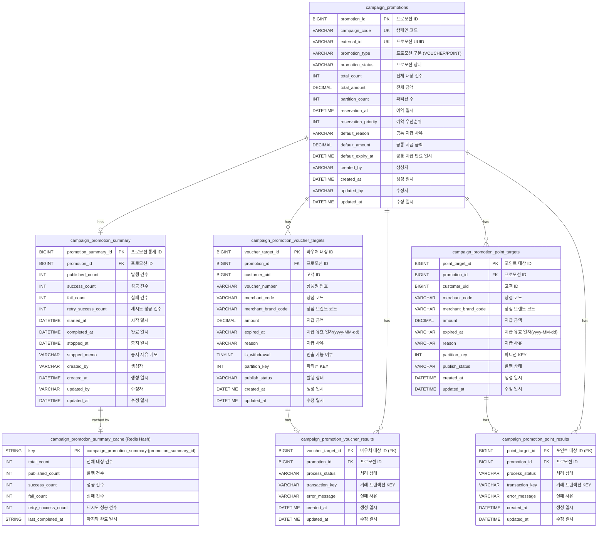

# Campaign Promotion ERD

## 개요

캠페인 프로모션 시스템의 데이터베이스 스키마입니다. 바우처(Voucher)와 포인트(Point) 두 가지 프로모션 타입을 지원합니다.

## ERD (Entity Relationship Diagram)



## 테이블 관계 설명

| 관계                                                                          | 설명                      |
|-----------------------------------------------------------------------------|-------------------------|
| `campaign_promotions` → `campaign_promotion_summary`                        | 1:1 관계. 프로모션별 처리 현황 집계  |
| `campaign_promotions` → `campaign_promotion_voucher_targets`                | 1:N 관계. 바우처 프로모션 대상자 목록 |
| `campaign_promotions` → `campaign_promotion_point_targets`                  | 1:N 관계. 포인트 프로모션 대상자 목록 |
| `campaign_promotion_voucher_targets` → `campaign_promotion_voucher_results` | 1:1 관계. 바우처 지급 처리 결과    |
| `campaign_promotion_point_targets` → `campaign_promotion_point_results`     | 1:1 관계. 포인트 지급 처리 결과    |

## 상태 코드 정의

### promotion_status (프로모션 상태)

| 코드            | 설명 |
|---------------|----|
| `READY`       | 대기 |
| `IN_PROGRESS` | 진행 |
| `COMPLETED`   | 완료 |
| `STOPPED`     | 중단 |
| `FAILED`      | 실패 |

### promotion_type (프로모션 구분)

| 코드        | 설명       |
|-----------|----------|
| `VOUCHER` | 바우처 프로모션 |
| `POINT`   | 포인트 프로모션 |

### publish_status (발행 상태)

| 코드          | 설명    |
|-------------|-------|
| `PENDING`   | 대기    |
| `PUBLISHED` | 발행 완료 |
| `FAILED`    | 실패    |

### process_status (처리 상태)

| 코드         | 설명  |
|------------|-----|
| `PENDING`  | 대기  |
| `SUCCESS`  | 성공  |
| `RETRYING` | 재시도 |
| `FAILED`   | 실패  |

### campaign_promotion_summary Cache 구조 (Redis Hash)

- Cache Key: `campaign_promotion_summary:{promotion_summary_id}`
- Type: **Hash**

| Field               | Type    | Description                |
|---------------------|---------|----------------------------|
| total_count         | Integer | 전체 대상 건수                   |
| published_count     | Integer | 발행 건수                      |
| success_count       | Integer | 성공 건수                      |
| fail_count          | Integer | 실패 건수                      |
| retry_success_count | Integer | 재시도 성공 건수                  |
| last_completed_at   | String  | 마지막 완료 일시 (yyyyMMddHHmmss) |

#### 사용 명령어

```bash
# 카운트 증가 (Atomic)
HINCRBY campaign_promotion_summary:{id} published_count 1
HINCRBY campaign_promotion_summary:{id} success_count 1

# 전체 조회
HGETALL campaign_promotion_summary:{id}

# 특정 필드 조회
HGET campaign_promotion_summary:{id} success_count

# TTL 설정
EXPIRE campaign_promotion_summary:{id} {seconds}
```