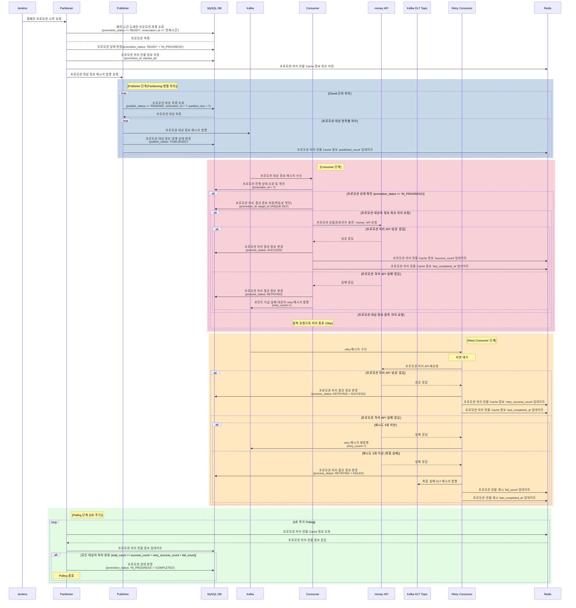

# 캠페인 프로모션 포인트/상품권 지급 시스템 시퀀스 다이어그램

## Mermaid 시퀀스 다이어그램


  
---  

## 상세 흐름 설명

### 1단계: 프로모션 시작 및 초기화

| 순서 | 발신자         | 수신자         | 동작                                                                                                      |
|:--:|-------------|-------------|---------------------------------------------------------------------------------------------------------|
| 1  | Jenkins     | Partitioner | 캠페인 프로모션 시작 요청                                                                                          |
| 2  | Partitioner | MySQL DB    | 프로모션 목록 조회<br>`campaign_promotions`<br>WHERE `promotion_status = 'READY'` AND `reservation_at <= NOW()` |
| 3  | MySQL DB    | Partitioner | 프로모션 목록 응답                                                                                              |
| 4  | Partitioner | MySQL DB    | 프로모션 상태 변경<br>`campaign_promotions`<br>SET `promotion_status = 'IN_PROGRESS'`                           |
| 5  | Partitioner | MySQL DB    | 프로모션 처리 현황 정보 저장<br>`campaign_promotion_summary`<br>INSERT (`promotion_id`, `started_at`)               |
| 6  | Partitioner | Redis       | 프로모션 처리 현황 Cache 정보 최초 저장                                                                               |
| 7  | Partitioner | Publisher   | 프로모션 대상 정보 메시지 발행 요청                                                                                    |

---  

### 2단계: Publisher - 메시지 발행 (Chunk 단위)

| 순서 | 발신자       | 수신자       | 동작                                                                                                                                                                              |
|:--:|-----------|-----------|---------------------------------------------------------------------------------------------------------------------------------------------------------------------------------|
| 8  | Publisher | MySQL DB  | 프로모션 대상 목록 조회<br>`campaign_promotion_voucher_targets` / `campaign_promotion_point_targets`<br>WHERE `publish_status = 'PENDING'` AND `promotion_id = ?` AND `partition_key = ?` |
| 9  | MySQL DB  | Publisher | 프로모션 대상 목록 응답                                                                                                                                                                   |
| 10 | Publisher | Kafka     | 프로모션 대상 정보 메시지 발행                                                                                                                                                               |
| 11 | Publisher | MySQL DB  | 프로모션 대상 정보 발행 상태 변경<br>`campaign_promotion_voucher_targets` / `campaign_promotion_point_targets`<br>SET `publish_status = 'PUBLISHED'`                                          |
| 12 | Publisher | Redis     | 프로모션 처리 현황 Cache 정보 `published_count` 업데이트                                                                                                                                      |  

**메시지 포맷:**

###### 상품권 프로모션 대상자 Message

```json
{
    "promotion_id": "1",
    "voucher_target_id": "1",
    "customer_uid": "12345",
    "voucher_number": "voucher_number",
    "merchant_code": "merchant_code",
    "merchant_brand_code": "merchant_brand_code",
    "amount": "10000",
    "is_withdrawal": "1",
    "valid_until": "20261231235959",
    "reason": "새해맞이 프로모션 상품권 지급",
    "partition_key": "0"
}
```  

#### 포인트 프로모션 대상자 Message

```json
{
    "promotion_id": "1",
    "point_target_id": "1",
    "customer_uid": "12345",
    "amount": "50000",
    "expiry_at": "20261231235959",
    "reason": "새해맞이 프로모션 포인트 지급",
    "partition_key": "0"
}
```
  
---  

### 3단계: Consumer - 메시지 소비 및 API 호출

| 순서 | 발신자      | 수신자       | 동작                                                                                                                                                                                     |
|:--:|----------|-----------|----------------------------------------------------------------------------------------------------------------------------------------------------------------------------------------|
| 13 | Kafka    | Consumer  | 프로모션 대상 정보 메시지 수신                                                                                                                                                                      |
| 14 | Consumer | MySQL DB  | 프로모션 진행 상태 조회 및 확인<br>`campaign_promotions`<br>WHERE `promotion_id = ?`, CHECK `promotion_status = 'IN_PROGRESS'`                                                                      |
| 15 | Consumer | MySQL DB  | 프로모션 처리 결과 정보 저장 - 멱등성 확인<br>`campaign_promotion_voucher_results` / `campaign_promotion_point_results`<br>INSERT (`promotion_id`, `voucher_target_id` / `point_target_id`) - PK로 중복 체크 |
| 16 | Consumer | money API | 프로모션 상품권/포인트 충전 API 요청<br>- 캠페인 상품권 충전 API: `/internal/v1/campaigns/voucher/charge`<br>- 캠페인 포인트 충전 API: `/internal/v1/campaigns/point/charge`                                         |

#### 성공 시:
| 순서 | 발신자       | 수신자      | 동작                                                                                                                                |
|:--:|-----------|----------|-----------------------------------------------------------------------------------------------------------------------------------|
| 17 | money API | Consumer | 성공 응답                                                                                                                             |
| 18 | Consumer  | MySQL DB | 프로모션 처리 결과 정보 변경<br>`campaign_promotion_voucher_results` / `campaign_promotion_point_results`<br>SET `process_status = 'SUCCESS'` |
| 19 | Consumer  | Redis    | 프로모션 현황 캐시 `success_count` 업데이트                                                                                                   |
| 20 | Consumer  | Redis    | 프로모션 현황 캐시 `last_completed_at` 업데이트                                                                                               |

#### 실패 시:
| 순서 | 발신자       | 수신자      | 동작                                                                                                                                 |
|:--:|-----------|----------|------------------------------------------------------------------------------------------------------------------------------------|
| 17 | money API | Consumer | 실패 응답                                                                                                                              |
| 18 | Consumer  | MySQL DB | 프로모션 처리 결과 정보 변경<br>`campaign_promotion_voucher_results` / `campaign_promotion_point_results`<br>SET `process_status = 'RETRYING'` |
| 19 | Consumer  | Kafka    | retry 메시지 발행 (`retry_count++`)                                                                                                     |

#### 중복 요청 시:
| 순서 | 발신자      | 수신자 | 동작                   |
|:--:|----------|-----|----------------------|
| -  | Consumer | -   | 중복 요청으로 처리 종료 (Skip) |  
  
---  

### 4단계: Retry Consumer - 재시도 처리

| 순서 | 발신자            | 수신자            | 동작              |
|:--:|----------------|----------------|-----------------|
| 21 | Kafka          | Retry Consumer | retry 메시지 수신    |
| 22 | Retry Consumer | -              | 지연 대기           |
| 23 | Retry Consumer | money API      | 프로모션 처리 API 재요청 |

#### 재시도 성공 시:
| 순서 | 발신자            | 수신자            | 동작                                                                                                                                |
|:--:|----------------|----------------|-----------------------------------------------------------------------------------------------------------------------------------|
| 24 | money API      | Retry Consumer | 성공 응답                                                                                                                             |
| 25 | Retry Consumer | MySQL DB       | 프로모션 처리 결과 정보 변경<br>`campaign_promotion_voucher_results` / `campaign_promotion_point_results`<br>SET `process_status = 'SUCCESS'` |
| 26 | Retry Consumer | Redis          | 프로모션 현황 캐시 `retry_success_count` 업데이트                                                                                             |
| 27 | Retry Consumer | Redis          | 프로모션 현황 캐시 `last_completed_at` 업데이트                                                                                               |

#### 재시도 실패 시 (5회 미만):
| 순서 | 발신자            | 수신자            | 동작                              |
|:--:|----------------|----------------|---------------------------------|
| 24 | money API      | Retry Consumer | 실패 응답                           |
| 25 | Retry Consumer | Kafka          | retry 메시지 재발행 (`retry_count++`) |

#### 최종 실패 시 (5회 이상):
| 순서 | 발신자            | 수신자            | 동작                                                                                                                               |
|:--:|----------------|----------------|----------------------------------------------------------------------------------------------------------------------------------|
| 24 | money API      | Retry Consumer | 실패 응답                                                                                                                            |
| 25 | Retry Consumer | MySQL DB       | 프로모션 처리 결과 정보 변경<br>`campaign_promotion_voucher_results` / `campaign_promotion_point_results`<br>SET `process_status = 'FAILED'` |
| 26 | Retry Consumer | Kafka DLT      | 최종 실패 DLT 메시지 발행                                                                                                                 |
| 27 | Retry Consumer | Redis          | 프로모션 현황 캐시 `fail_count` 업데이트                                                                                                     |
| 28 | Retry Consumer | Redis          | 프로모션 현황 캐시 `last_completed_at` 업데이트                                                                                              |  
  
---  

### 5단계: Polling 스케줄링 (5초 주기)

| 순서 | 발신자         | 수신자         | 동작                                                                                                                                     |
|:--:|-------------|-------------|----------------------------------------------------------------------------------------------------------------------------------------|
| 29 | Partitioner | Redis       | 프로모션 처리 현황 Cache 정보 조회                                                                                                                 |
| 30 | Redis       | Partitioner | 프로모션 처리 현황 정보 응답                                                                                                                       |
| 31 | Partitioner | MySQL DB    | 프로모션 처리 현황 정보 업데이트<br>`campaign_promotion_summary`<br>UPDATE (`published_count`, `success_count`, `fail_count`, `retry_success_count`) |

#### 모든 대상자 처리 완료 시:
| 순서 | 발신자         | 修신자      | 동작                                                                                                  |
|:--:|-------------|----------|-----------------------------------------------------------------------------------------------------|
| 32 | Partitioner | MySQL DB | 프로모션 상태 변경<br>`campaign_promotions`<br>SET `promotion_status = 'COMPLETED'`, `completed_at = NOW()` |
| -  | Partitioner | -        | Polling 종료                                                                                          |

**완료 조건:** `total_count == success_count + retry_success_count + fail_count`  
  
---  

## Redis 캐시 필드 정리

| 필드명                   | 설명        | 업데이트 시점                   |  
|-----------------------|-----------|---------------------------|  
| `total_count`         | 전체 대상자 수  | 프로모션 시작 시                 |  
| `published_count`     | 발행된 메시지 수 | Publisher에서 메시지 발행 후      |  
| `success_count`       | 성공 처리 수   | Consumer에서 API 성공 시       |  
| `retry_success_count` | 재시도 성공 수  | Retry Consumer에서 API 성공 시 |  
| `fail_count`          | 최종 실패 수   | 5회 이상 재시도 실패 시            |  
| `last_completed_at`   | 마지막 처리 시간 | 성공/실패 처리 완료 시             |  
  
---  

## 상태값 정리

### promotion_status (프로모션 상태)
| 상태            | 설명                     |
|---------------|------------------------|
| `READY`       | 프로모션 대기 (예약 시간 도래 전)   |
| `IN_PROGRESS` | 프로모션 진행 중              |
| `COMPLETED`   | 프로모션 완료 (모든 대상자 처리 완료) |

### publish_status (지급 대상자 발행 상태)
| 상태          | 설명    |
|-------------|-------|
| `PENDING`   | 발행 대기 |
| `PUBLISHED` | 발행 완료 |

### process_status (프로모션 처리 결과 상태)
| 상태         | 설명                   |
|------------|----------------------|
| `SUCCESS`  | 처리 성공                |
| `RETRYING` | 재시도 중                |
| `FAILED`   | 최종 실패 (5회 이상 재시도 실패) |