# Campaign Promotion Redis Stream Architecture  
  
## 1. 개요 (Overview)  
  
캠페인 프로모션 처리 파이프라인은 대량의 포인트/상품권 지급 요청을 안정적으로 처리하기 위한 아키텍처이다.  
  
### 도입 배경  
  
기존에는 Kafka Consumer가 메시지를 수신하면 즉시 Money API를 호출하는 구조였다. 이 방식은 대량 프로모션 시 다음과 같은 문제가 있었다:  
  
- Kafka Consumer의 동시성이 파티션 수에 제한됨  
- 대량 메시지 처리 시 Money API에 대한 병렬 호출 제어가 어려움  
  
이를 해결하기 위해 **Redis Stream**을 중간 큐잉 레이어로 도입하여, Kafka Consumer는 메시지를 Redis Stream에 적재하고, 별도의 Consumer가 Stream에서 메시지를 폴링하여 Money API를 호출하는 구조로 변경하였다.  
  
### Feature Flag 분기  
  
`redis.stream.enabled` 프로퍼티를 통해 Redis Stream 사용 여부를 제어한다:  
  
- **`true`**: Kafka → Processor(DB 저장) → Redis Stream → Stream Consumer → Money API  
- **`false`**: Kafka → Processor(DB 저장 + 직접 Money API 호출) *(기존 방식)*  
  
`CampaignPromotionStartedListener`는 `@ConditionalOnProperty(prefix = "redis.stream", name = ["enabled"], havingValue = "true")`로 선언되어, feature flag가 `true`일 때만 Bean으로 등록된다.  
  
---  
  
## 2. 전체 아키텍처 흐름도  
  
```mermaid  
flowchart TB  
    subgraph Kafka["Kafka Topics"]  
        KP["campaign-promotion-point-publish"]  
        KV["campaign-promotion-voucher-publish"]  
        KS["campaign-promotion-started"]  
        KPR["campaign-promotion-point-retry"]  
        KVR["campaign-promotion-voucher-retry"]  
    end  
  
    subgraph Listeners["Kafka Listeners"]  
        PL["CampaignPointPromotionListener"]  
        VL["CampaignVoucherPromotionListener"]  
        SL["CampaignPromotionStartedListener\n(ConditionalOnProperty)"]  
        PRL["CampaignPointPromotionRetryListener"]  
        VRL["CampaignVoucherPromotionRetryListener"]  
    end  
  
    subgraph Processors["Processors"]  
        PP["CampaignPromotionPointProcessor"]  
        VP["CampaignPromotionVoucherProcessor"]  
        PPR["CampaignPromotionPointRetryProcessor"]  
        VPR["CampaignPromotionVoucherRetryProcessor"]  
    end  
  
    subgraph RedisStream["Redis Stream"]  
        RS["campaign-promotion-stream\n:{type}:{promotionId}"]  
    end  
  
    subgraph StreamInfra["Stream Infrastructure"]  
        SM["CampaignPromotionStreamManager"]  
        SC["CampaignPromotionStreamConsumer"]  
        SP["CampaignPromotionStreamProducer"]  
    end  
  
    DB[(Database)]  
    MoneyAPI["Money API"]  
  
    KP --> PL  
    KV --> VL  
    KS --> SL  
    KPR --> PRL  
    KVR --> VRL  
  
    PL --> PP  
    VL --> VP  
    PRL --> PPR  
    VRL --> VPR  
  
    PP -- "1. saveResult()" --> DB  
    VP -- "1. saveResult()" --> DB  
  
    PP -- "2. enqueueToStream()\n(stream.enabled=true)" --> SP  
    VP -- "2. enqueueToStream()\n(stream.enabled=true)" --> SP  
    SP --> RS  
  
    PP -. "2. executeMoneyApi()\n(stream.enabled=false)" .-> MoneyAPI  
    VP -. "2. executeMoneyApi()\n(stream.enabled=false)" .-> MoneyAPI  
  
    SL -- "startConsumers()" --> SM  
    SM -- "create & manage" --> SC  
    SC -- "poll (non-blocking)" --> RS  
    SC -- "processStreamMessage()" --> PP  
    SC -- "processStreamMessage()" --> VP  
    PP -- "executeMoneyApi()" --> MoneyAPI  
    VP -- "executeMoneyApi()" --> MoneyAPI  
  
    MoneyAPI -- "실패 시 retry 발행" --> KPR  
    MoneyAPI -- "실패 시 retry 발행" --> KVR  
  
    PPR -- "callMoneyApi()" --> MoneyAPI  
    VPR -- "callMoneyApi()" --> MoneyAPI  
```  
  
---  
  
## 3. 클래스 다이어그램  
  
### 3-1. Redis Stream Infrastructure  
  

  
### 3-2. Stream Manager  
  

  
### 3-3. Processor (Template Method Pattern)  
  

  
### 3-4. Kafka Listener  

```mermaid  
classDiagram  
    class CampaignPointPromotionListener {  
        <<Component>>  
        -pointProcessor: CampaignPromotionPointProcessor  
        +listen(key, message, acknowledge) Unit  
    }  
    note for CampaignPointPromotionListener "topic: campaign-promotion-point-publish\ngroupId: prepay-admin-campaign-point"  
  
    class CampaignVoucherPromotionListener {  
        <<Component>>  
        -voucherProcessor: CampaignPromotionVoucherProcessor  
        +listen(key, message, acknowledge) Unit  
    }  
    note for CampaignVoucherPromotionListener "topic: campaign-promotion-voucher-publish\ngroupId: prepay-admin-campaign-voucher"  
  
    class CampaignPointPromotionRetryListener {  
        <<Component>>  
        -pointRetryProcessor: CampaignPromotionPointRetryProcessor  
        +listen(key, message, acknowledge) Unit  
    }  
    note for CampaignPointPromotionRetryListener "topic: campaign-promotion-point-retry\ngroupId: prepay-admin-campaign-point-retry"  
  
    class CampaignVoucherPromotionRetryListener {  
        <<Component>>  
        -voucherRetryProcessor: CampaignPromotionVoucherRetryProcessor  
        +listen(key, message, acknowledge) Unit  
    }  
    note for CampaignVoucherPromotionRetryListener "topic: campaign-promotion-voucher-retry\ngroupId: prepay-admin-campaign-voucher-retry"  
  
    class CampaignPromotionStartedListener {  
        <<Component>>  
        <<ConditionalOnProperty>>  
        -streamManager: CampaignPromotionStreamManager  
        -objectMapper: ObjectMapper  
        +listen(key, message, acknowledge) Unit  
    }  
    note for CampaignPromotionStartedListener "topic: campaign-promotion-started\ngroupId: {hostname}-{pid}-promotion-started\ncondition: redis.stream.enabled=true"  
  
    CampaignPointPromotionListener --> CampaignPromotionPointProcessor : processTopicMessage()  
    CampaignVoucherPromotionListener --> CampaignPromotionVoucherProcessor : processTopicMessage()  
    CampaignPointPromotionRetryListener --> CampaignPromotionPointRetryProcessor : process()  
    CampaignVoucherPromotionRetryListener --> CampaignPromotionVoucherRetryProcessor : process()  
    CampaignPromotionStartedListener --> CampaignPromotionStreamManager : startConsumers()  
```  
  

  
---  
  
## 4. 주요 클래스 정의  
  
### 4-1. Redis Stream Infrastructure  
  
| 클래스 | 역할 | 핵심 메서드 | 주요 의존성 |  
|--------|------|-------------|-------------|  
| `RedisStreamConfig` | Stream 전용 Redis 연결 및 Template 설정 | `streamRedisConnectionFactory()`, `streamRedisTemplate()` | `RedisStreamProperties` |  
| `RedisStreamProperties` | Stream 관련 설정값 바인딩 (`redis.stream.*`) | — (data class) | — |  
| `RedisStreamOperationExtensions` | Spring Data Redis API를 간결한 확장 함수로 래핑 | `xAdd`, `xReadGroup`, `xAck`, `xGroupCreate` 등 12개 | `StringRedisTemplate` |  
| `CampaignPromotionStreamKeys` | Stream key 및 Consumer Group 이름 생성 규칙 정의 | `streamKey()`, `consumerGroup()` | `PromotionType` |  
| `CampaignPromotionStreamProducer` | Redis Stream에 메시지 발행 (XADD) | `enqueue(streamKey, key, message)` | `StringRedisTemplate`, `RedisStreamProperties` |  
| `CampaignPromotionStreamConsumer` | Redis Stream 메시지 처리 및 ACK | `processMessage(message)` | `AbstractCampaignPromotionProcessor`, `StringRedisTemplate` |  
  
### 4-2. Stream Manager  
  
| 클래스 | 역할 | 핵심 메서드 | 주요 의존성 |  
|--------|------|-------------|-------------|  
| `CampaignPromotionStreamManager` | Consumer 라이프사이클 오케스트레이션 | `startConsumers()`, `stopConsumers()`, `calculateConsumerCountPerInstance()` | `ConsumerRegistry`, `ProcessorResolver`, `PollingTaskFactory`, `RedisStreamProperties` |  
| `CampaignPromotionStreamConsumerContext` | Consumer 실행 상태 보관 (data class) | — | `ExecutorService`, `AtomicBoolean`, `AtomicLong` |  
| `CampaignPromotionStreamConsumerRegistry` | SmartLifecycle 기반 Consumer 등록/해제 관리 | `register()`, `shutdown()`, `shutdownAll()` | `CampaignPromotionStreamConsumerContext` |  
| `CampaignPromotionStreamPollingTaskFactory` | Non-blocking 폴링 Runnable 생성 | `create(...)` | `RedisStreamProperties` |  
  
### 4-3. Processor  
  
| 클래스 | 역할 | 핵심 메서드 | 주요 의존성 |  
|--------|------|-------------|-------------|  
| `AbstractCampaignPromotionProcessor<M, R>` | Kafka/Stream 메시지 처리 템플릿 (Template Method) | `processTopicMessage()`, `processStreamMessage()`, `executeMoneyApi()`, `enqueueToStream()` | `ObjectMapper`, `StreamProducer`, `RedisStreamProperties`, `EventProviderService` |  
| `CampaignPromotionVoucherProcessor` | 상품권 지급 처리 구현체 | `saveResult()`, `callMoneyApi()` (chargeVoucher) | `VoucherResultRepository`, `CampaignMoneyApiCallService` |  
| `CampaignPromotionPointProcessor` | 포인트 지급 처리 구현체 | `saveResult()`, `callMoneyApi()` (chargePoint) | `PointResultRepository`, `CampaignMoneyApiCallService` |  
| `AbstractCampaignPromotionRetryProcessor<M, R>` | 재시도 처리 템플릿 (최대 5회) | `process()`, `handleRetryFailure()` | `ObjectMapper`, `EventProviderService` |  
| `CampaignPromotionVoucherRetryProcessor` | 상품권 재시도 처리 구현체 | `callMoneyApi()` (chargeVoucher) | `VoucherResultRepository`, `CampaignMoneyApiCallService` |  
| `CampaignPromotionPointRetryProcessor` | 포인트 재시도 처리 구현체 | `callMoneyApi()` (chargePoint) | `PointResultRepository`, `CampaignMoneyApiCallService` |  
| `CampaignPromotionProcessorResolver` | PromotionType 기반 Processor 탐색 | `resolve(type)` | `List<AbstractCampaignPromotionProcessor>` |  
  
### 4-4. Kafka Listener  
  
| 클래스 | 역할 | Topic | Group ID |  
|--------|------|-------|----------|  
| `CampaignPointPromotionListener` | 포인트 프로모션 메시지 수신 | `campaign-promotion-point-publish` | `prepay-admin-campaign-point` |  
| `CampaignVoucherPromotionListener` | 상품권 프로모션 메시지 수신 | `campaign-promotion-voucher-publish` | `prepay-admin-campaign-voucher` |  
| `CampaignPointPromotionRetryListener` | 포인트 재시도 메시지 수신 | `campaign-promotion-point-retry` | `prepay-admin-campaign-point-retry` |  
| `CampaignVoucherPromotionRetryListener` | 상품권 재시도 메시지 수신 | `campaign-promotion-voucher-retry` | `prepay-admin-campaign-voucher-retry` |  
| `CampaignPromotionStartedListener` | 프로모션 시작 이벤트 수신 → Stream Consumer 기동 | `campaign-promotion-started` | `{hostname}-{pid}-promotion-started` (인스턴스별 브로드캐스트) |  
  
---  
  
## 5. 핵심 설계 패턴  
  
### Template Method Pattern  
  
`AbstractCampaignPromotionProcessor`와 `AbstractCampaignPromotionRetryProcessor`가 메시지 처리 흐름의 골격을 정의하고, 구체적인 파싱·저장·API 호출·결과 처리는 서브클래스(Voucher/Point)에서 구현한다.  
  
```  
processTopicMessage() 흐름:  
  1. parseMessage()          ← abstract  
  2. saveResult()            ← abstract (@Transactional REQUIRES_NEW)  
  3-a. enqueueToStream()     ← stream.enabled=true 일 때  
  3-b. executeMoneyApi()     ← stream.enabled=false 일 때  
       ├── callMoneyApi()    ← abstract  
       ├── updateSuccess()   ← abstract (성공 시)  
       └── handleFailure()   ← 실패 시 retry 발행  
```  
  
### Strategy Pattern (ProcessorResolver)  
  
`CampaignPromotionProcessorResolver`는 Spring이 주입한 `List<AbstractCampaignPromotionProcessor>`를 `PromotionType`으로 인덱싱하여, 런타임에 적합한 Processor를 반환한다. `CampaignPromotionStreamManager`에서 Consumer 기동 시 사용된다.  
  
### Factory Pattern (PollingTaskFactory)  
  
`CampaignPromotionStreamPollingTaskFactory`는 Consumer별 폴링 `Runnable`을 생성한다. 각 Runnable은 non-blocking XREADGROUP 루프를 실행하며, idle timeout 시 자동 종료 콜백을 호출한다.  
  
### Non-blocking Polling (ElastiCache Workaround)  
  
ElastiCache Valkey 7.2.6 환경에서 `XREADGROUP BLOCK` 명령이 새로 생성된 전용 커넥션에서 거부되는 문제가 있다. Spring Data Redis는 blocking 명령에 전용 커넥션을 생성하므로 항상 실패한다.  
  
이를 우회하기 위해 **BLOCK 없는 XREADGROUP + configurable polling interval** 방식을 채택하였다:  
  
```  
while (!stopFlag) {  
    messages = XREADGROUP(COUNT batchSize)   // non-blocking  
    if (messages.isNotEmpty()) {  
        process(messages)  
        updateLastMessageTime()  
    } else {  
        if (idleTime >= idleTimeoutSeconds) {  
            onIdleStop()   // 자동 종료  
            break  
        }  
        sleep(pollIntervalMs)   // busy-wait 방지  
    }  
}  
```  
  
### Virtual Thread Executor  
  
각 프로모션별로 Virtual Thread 기반 `ExecutorService`를 생성하여 다수의 Consumer를 경량 스레드로 운영한다. Consumer 수는 `totalCount`에 따라 동적으로 결정된다:  
  
| totalCount | Consumer 수 |  
|------------|-------------|  
| ≤ 100 | 1 |  
| ≤ 1,000 | 2 |  
| ≤ 10,000 | 4 |  
| ≤ 100,000 | 8 |  
| ≤ 500,000 | 16 |  
| > 500,000 | 32 |  
  
*(min/max는 `RedisStreamProperties`의 `minConsumerPerInstance`, `maxConsumerPerInstance`로 클램핑)*  
  
---  
  
## 6. 설정 프로퍼티 (RedisStreamProperties)  
  
| 프로퍼티 | 타입 | 기본값 | 운영 설정 | 설명 |  
|----------|------|--------|-----------|------|  
| `redis.stream.enabled` | Boolean | `false` | `true` | Redis Stream 사용 여부 (Feature Flag) |  
| `redis.stream.max-len` | Long | `100,000` | `100,000` | Stream MAXLEN (approximate trimming) |  
| `redis.stream.poll-interval-ms` | Long | `100` | `5,000` | Non-blocking 폴링 간격 (ms) |  
| `redis.stream.idle-timeout-seconds` | Long | `30` | `30` | 메시지 없을 시 자동 종료 대기 시간 (초) |  
| `redis.stream.batch-size` | Int | `10` | `10` | XREADGROUP COUNT 값 |  
| `redis.stream.min-consumer-per-instance` | Int | `1` | `8` | 인스턴스당 최소 Consumer 수 |  
| `redis.stream.max-consumer-per-instance` | Int | `32` | `32` | 인스턴스당 최대 Consumer 수 |  
  
---  
  
## 7. Stream Key 네이밍 규칙  
  
| 항목 | 패턴 | 예시 |  
|------|------|------|  
| Stream Key | `campaign-promotion-stream:{type}:{promotionId}` | `campaign-promotion-stream:VOUCHER:12345` |  
| Consumer Group | `campaign-promotion-group:{type}:{promotionId}` | `campaign-promotion-group:VOUCHER:12345` |  
| Consumer Name | `{hostname}-{pid}-{index}` | `prepay-admin-7f8b9c-12345-0` |  
  
---  
  
## 8. 관련 파일 목록  
  
### Redis Stream Infrastructure (`infrastructure/redis/stream/`)  
  
| 파일 | 위치 |  
|------|------|  
| `CampaignPromotionStreamKeys.kt` | `stream/` |  
| `RedisStreamOperationExtensions.kt` | `stream/` |  
| `CampaignPromotionStreamConsumer.kt` | `stream/consumer/` |  
| `CampaignPromotionStreamProducer.kt` | `stream/producer/` |  
| `CampaignPromotionStreamManager.kt` | `stream/manager/` |  
| `CampaignPromotionStreamConsumerContext.kt` | `stream/manager/` |  
| `CampaignPromotionStreamConsumerRegistry.kt` | `stream/manager/` |  
| `CampaignPromotionStreamPollingTaskFactory.kt` | `stream/manager/` |  
  
### Configuration (`core/config/redis/`)  
  
| 파일 | 역할 |  
|------|------|  
| `RedisStreamConfig.kt` | Stream 전용 ConnectionFactory & Template |  
| `RedisStreamProperties.kt` | Stream 설정 프로퍼티 바인딩 |  
| `redis.yml` | 프로파일별 Redis 호스트 및 Stream 설정 |  
  
### Processor (`application/processor/`)  
  
| 파일 | 역할 |  
|------|------|  
| `AbstractCampaignPromotionProcessor.kt` | 메시지 처리 템플릿 (abstract) |  
| `AbstractCampaignPromotionRetryProcessor.kt` | 재시도 처리 템플릿 (abstract) |  
| `CampaignPromotionVoucherProcessor.kt` | 상품권 처리 구현체 |  
| `CampaignPromotionPointProcessor.kt` | 포인트 처리 구현체 |  
| `CampaignPromotionVoucherRetryProcessor.kt` | 상품권 재시도 구현체 |  
| `CampaignPromotionPointRetryProcessor.kt` | 포인트 재시도 구현체 |  
| `CampaignPromotionProcessorResolver.kt` | Processor 탐색 (Strategy) |  
  
### Kafka Listener (`infrastructure/kafka/listener/`)  
  
| 파일 | 역할 |  
|------|------|  
| `CampaignPointPromotionListener.kt` | 포인트 프로모션 수신 |  
| `CampaignVoucherPromotionListener.kt` | 상품권 프로모션 수신 |  
| `CampaignPointPromotionRetryListener.kt` | 포인트 재시도 수신 |  
| `CampaignVoucherPromotionRetryListener.kt` | 상품권 재시도 수신 |  
| `CampaignPromotionStartedListener.kt` | 프로모션 시작 이벤트 수신 |  
  
### DTO  
  
| 파일 | 역할 |  
|------|------|  
| `CampaignPromotionPointMessage.kt` | 포인트 프로모션 메시지 DTO |  
| `CampaignPromotionVoucherMessage.kt` | 상품권 프로모션 메시지 DTO |  
| `PromotionStartedMessage.kt` | 프로모션 시작 이벤트 DTO |  
  
### Logging  
  
| 파일                              | 역할                                  |     |
| ------------------------------- | ----------------------------------- | --- |
| `CampaignPromotionLogFormat.kt` | 통일된 로그 포맷 (Component + Stage + IDs) |     |