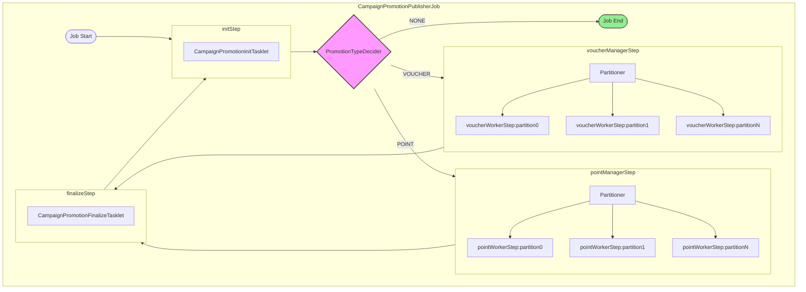
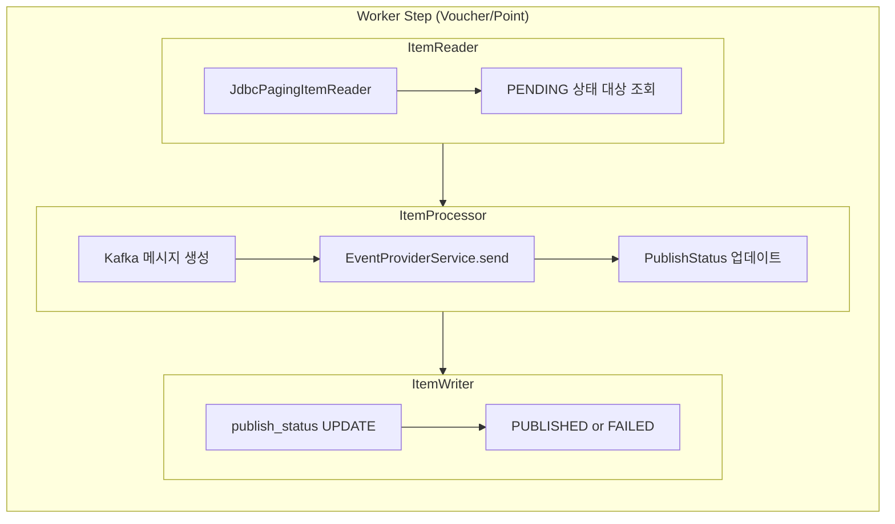
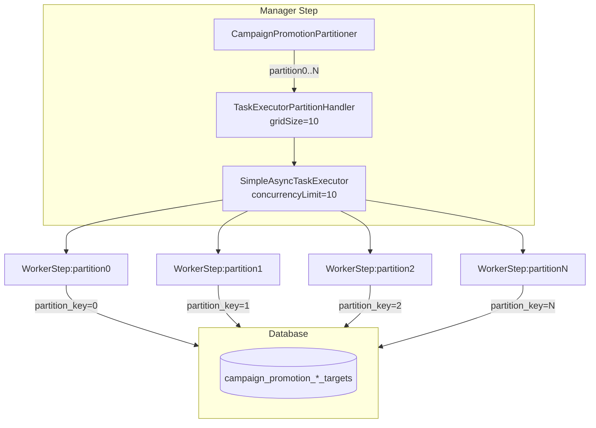
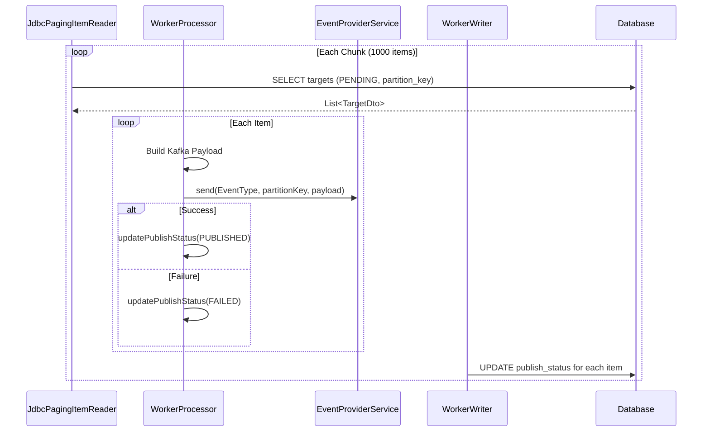
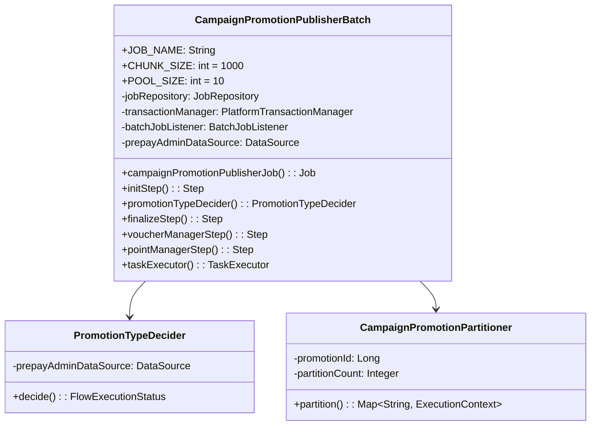
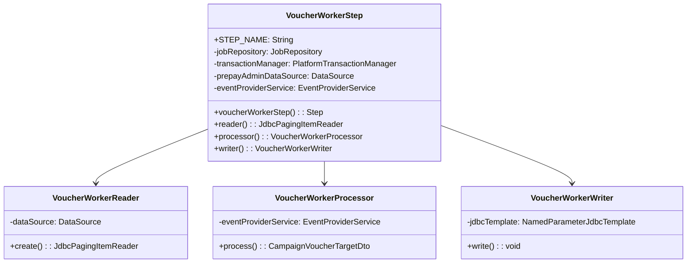
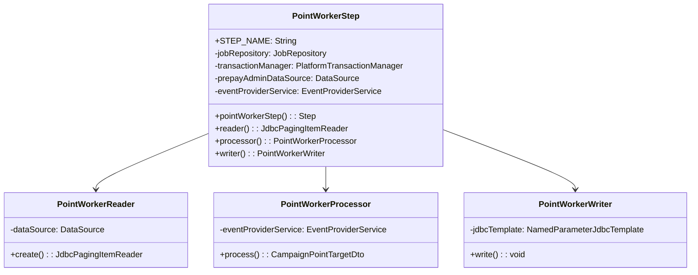
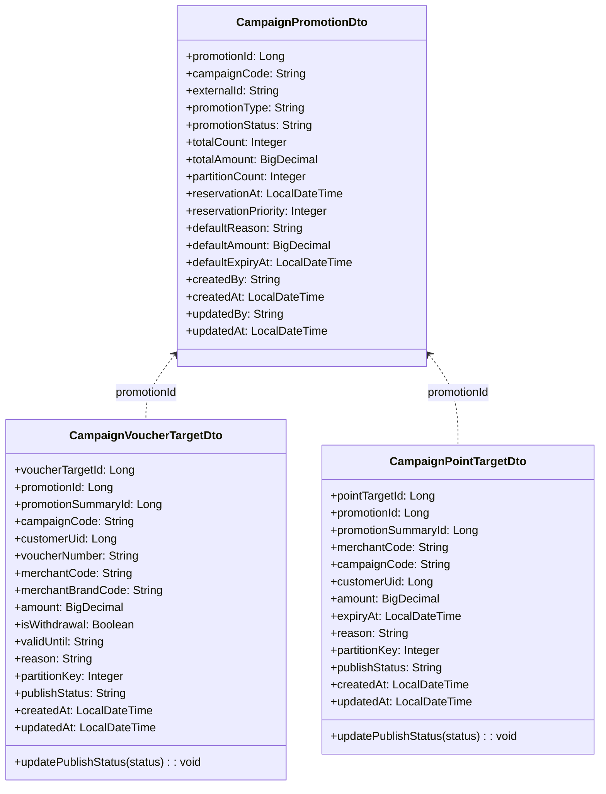
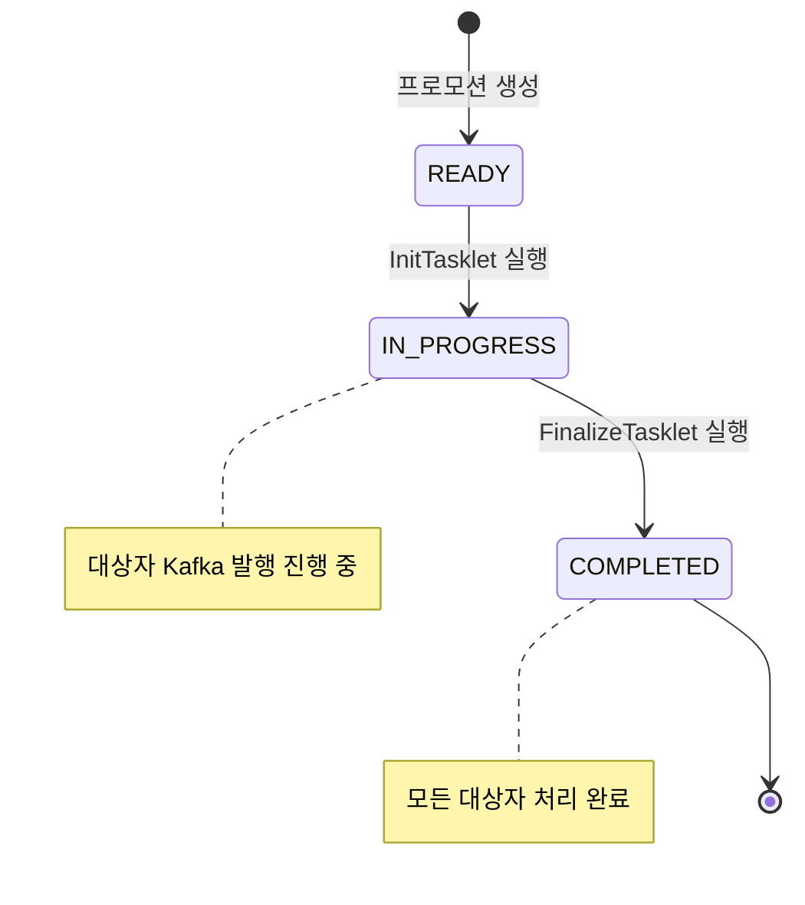
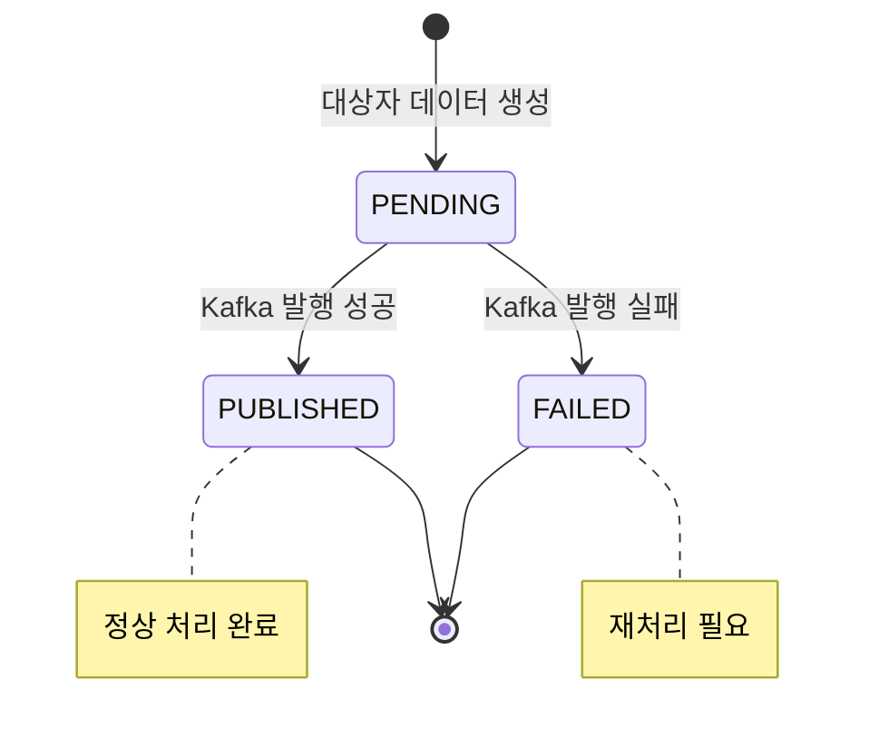

# CampaignPromotionPublisherJob 코드 리뷰

## 1. 개요

### Job 정보

| 항목 | 내용 |
|------|------|
| Job Name | `CampaignPromotionPublisherJob` |
| 설명 | 캠페인 프로모션 대상자에게 Voucher 또는 Point 지급 메시지를 Kafka로 발행 |
| 주요 테이블 | `campaign_promotions`, `campaign_promotion_voucher_targets`, `campaign_promotion_point_targets`, `campaign_promotion_summary` |

### 주요 설정값

| 상수 | 값 | 설명 |
|------|-----|------|
| `CHUNK_SIZE` | 1000 | 청크 단위 처리 크기 |
| `POOL_SIZE` | 10 | 병렬 처리 스레드 풀 크기 |

---

## 2. Batch Job 구성도

### Job Flow 다이어그램



### Step 구성 요약

| Step | 유형 | 설명 |
|------|------|------|
| `initStep` | Tasklet | READY 상태의 프로모션 조회 및 IN_PROGRESS 상태 변경 |
| `voucherManagerStep` | Partitioned Step | Voucher 타입 프로모션의 병렬 처리 관리 |
| `pointManagerStep` | Partitioned Step | Point 타입 프로모션의 병렬 처리 관리 |
| `finalizeStep` | Tasklet | 프로모션 상태를 COMPLETED로 변경 |

---

## 3. 처리 흐름도

### Worker Step 상세 흐름



### Partitioning 병렬 처리 구조



### Chunk 처리 시퀀스



---

## 4. 클래스 다이어그램

### Job Configuration 클래스



### Step Configuration 클래스





### DTO 클래스 다이어그램



---

## 5. 상태 전이 다이어그램

### Promotion 상태 전이



### Target PublishStatus 상태 전이



---

## 6. 코드 리뷰 체크리스트

### 코드 품질

| 항목 | 상태 | 설명 |
|------|------|------|
| 로깅 일관성 | ✅ | 모든 클래스에서 `[CampaignPromotion][promotionId={}][Component]` 형식의 일관된 로그 prefix 사용 |
| 책임 분리 | ✅ | Reader/Processor/Writer가 명확히 분리되어 각자의 역할만 수행 |
| 명명 규칙 | ✅ | 클래스, 메서드, 상수 모두 Java/Spring 컨벤션 준수 |
| 상수 관리 | ✅ | `CHUNK_SIZE`, `POOL_SIZE` 등 설정값이 상수로 관리됨 |

### 성능

| 항목 | 상태 | 설명 |
|------|------|------|
| 청크 크기 | ✅ | `CHUNK_SIZE=1000`으로 적절한 배치 처리 단위 설정 |
| 병렬 처리 | ✅ | `POOL_SIZE=10`으로 파티션별 병렬 처리 구현 |
| 페이징 | ✅ | `JdbcPagingItemReader` 사용으로 대용량 데이터 처리 가능 |
| 인덱스 활용 | ✅ | `partition_key`, `publish_status` 기반 조회로 인덱스 활용 가능 |

### 에러 핸들링

| 항목 | 상태 | 설명 |
|------|------|------|
| Processor 에러 처리 | ✅ | try-catch로 Kafka 발행 실패 시 FAILED 상태로 마킹, 예외 전파 방지 |
| 상태 복구 | ⚠️ | FAILED 상태의 대상자 재처리 로직이 별도로 필요 |
| 로깅 | ✅ | 에러 발생 시 상세 로그 기록 (error level + stack trace) |

### 트랜잭션 관리

| 항목 | 상태 | 설명 |
|------|------|------|
| Chunk 트랜잭션 | ✅ | Spring Batch의 chunk 단위 트랜잭션 관리 적용 |
| Tasklet 트랜잭션 | ✅ | `transactionManager`를 통한 트랜잭션 관리 |
| DB/Kafka 정합성 | ⚠️ | Kafka 발행 후 DB 업데이트 실패 시 불일치 가능성 존재 |

### 테스트 커버리지

| 항목 | 상태 | 권장사항 |
|------|------|----------|
| 단위 테스트 | - | Reader/Processor/Writer 개별 테스트 필요 |
| 통합 테스트 | - | End-to-End Job 실행 테스트 필요 |
| 파티셔닝 테스트 | - | 다중 파티션 병렬 처리 테스트 필요 |

---

## 7. 개선 제안

### 잠재적 이슈

| 이슈 | 심각도 | 설명 | 개선 방안 |
|------|--------|------|-----------|
| Kafka-DB 정합성 | Medium | Processor에서 Kafka 발행 성공 후 Writer에서 DB 업데이트 실패 시 데이터 불일치 | Outbox 패턴 또는 Kafka Transaction 도입 검토 |
| FAILED 재처리 | Low | FAILED 상태 대상자의 재처리 메커니즘 부재 | 별도 재처리 Job 또는 수동 재처리 기능 구현 |
| 무한 루프 가능성 | Low | READY 프로모션이 지속적으로 존재 시 Job이 종료되지 않을 수 있음 | 최대 반복 횟수 제한 또는 Job 단일 실행 정책 검토 |

### 코드 개선 포인트

| 항목 | 현재 상태 | 개선 제안 |
|------|----------|-----------|
| Writer 배치 업데이트 | 건별 UPDATE 실행 | `JdbcBatchItemWriter` 또는 batch update 적용으로 DB 호출 최적화 |
| PointWorkerWriter 로깅 | LOG_PREFIX 상수에 placeholder 포함 | VoucherWorkerWriter와 동일한 `logPrefix()` 메서드 방식으로 통일 |
| Reader @StepScope | Bean 정의에 @StepScope 적용됨 | 파티션별 독립적인 Reader 인스턴스 보장 확인 필요 |

### 모니터링 제안

| 항목 | 설명 |
|------|------|
| Job 실행 메트릭 | 처리 건수, 성공/실패 비율, 처리 시간 등 메트릭 수집 |
| 알림 설정 | FAILED 비율이 임계치 초과 시 알림 발송 |
| 대시보드 | 프로모션별 처리 현황 모니터링 대시보드 구성 |

---

## 8. 파일 구조

```
application/batch/src/main/java/com/musinsapayments/prepay/application/batch/
├── job/campaign/
│   ├── CampaignPromotionPublisherBatch.java    # Job Configuration
│   ├── partitioner/
│   │   └── CampaignPromotionPartitioner.java   # Partitioner
│   ├── processor/
│   │   ├── PointWorkerProcessor.java           # Point Processor
│   │   └── VoucherWorkerProcessor.java         # Voucher Processor
│   ├── reader/
│   │   ├── PointWorkerReader.java              # Point Reader
│   │   └── VoucherWorkerReader.java            # Voucher Reader
│   ├── step/
│   │   ├── PointWorkerStep.java                # Point Worker Step Config
│   │   └── VoucherWorkerStep.java              # Voucher Worker Step Config
│   ├── tasklet/
│   │   ├── CampaignPromotionFinalizeTasklet.java
│   │   └── CampaignPromotionInitTasklet.java
│   └── writer/
│       ├── PointWorkerWriter.java              # Point Writer
│       └── VoucherWorkerWriter.java            # Voucher Writer
├── decider/
│   └── PromotionTypeDecider.java               # Job Flow Decider
└── dto/campaign/
    ├── CampaignPointTargetDto.java
    ├── CampaignPointTargetRowMapper.java
    ├── CampaignPromotionDto.java
    ├── CampaignPromotionRowMapper.java
    ├── CampaignVoucherTargetDto.java
    └── CampaignVoucherTargetRowMapper.java
```
